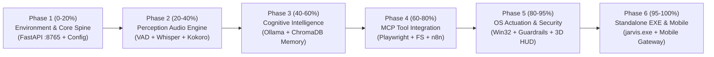

### J.A.R.V.I.S. Implementation Master Plan: From Zero to 100%

To transition J.A.R.V.I.S. from **Specification Documents** to a **100% Working Production Python System**, here is your 6-Phase Implementation Roadmap and the **exact prompt to give in your new chat**.

---

## 1. The 6-Phase Implementation Roadmap (0% to 100%)



---

### Phase Breakdowns

#### Phase 1: Core System Spine & Environment Bootstrapping (0% ➔ 20%)
- **Target Files**: `jarvis/config.py`, `jarvis/system/spec_loader.py`, `jarvis/main.py` (FastAPI Spine Server at `127.0.0.1:8765`), and `scripts/bootstrap_env.ps1`.
- **Goal**: Establish the zero-hardcode configuration loader, verify OpenVINO / Iris Xe hardware acceleration, and boot the core FastAPI server.

#### Phase 2: Streaming Audio & Perception Engine (20% ➔ 40%)
- **Target Files**: `jarvis/audio/vad.py` (Silero VAD), `jarvis/audio/wakeword.py` (openWakeWord), `jarvis/audio/stt.py` (Whisper INT8), and `jarvis/audio/tts.py` (Kokoro-82M ONNX).
- **Goal**: Enable continuous low-power microphone listening, instant wake phrase recognition, and 24kHz chunked streaming voice output.

#### Phase 3: Cognitive Core & Tiered Memory Vault (40% ➔ 60%)
- **Target Files**: `jarvis/llm/engine.py` (Ollama OpenVINO API), `jarvis/context/budget.py` (10/15/25/35/15 token slots & 3-ring context compaction), `jarvis/memory/semantic.py` (ChromaDB vector store + KùzuDB knowledge graph), and `jarvis/agents/conversational.py`.
- **Goal**: Establish sub-50ms TTFT Llama 3.2 3B chat responses with persistent episodic memory recall.

#### Phase 4: MCP Tools & Automated Workflows (60% ➔ 80%)
- **Target Files**: `jarvis/mcp/manager.py` (stdio process supervisor), `jarvis/mcp/router.py` (3-stage hybrid intent router), `jarvis/browser/playwright_client.py`, `jarvis/filesystem/operations.py` (`es.exe` Everything search), and `jarvis/workflows/n8n_deployer.py`.
- **Goal**: Connect live MCP servers (Playwright, Filesystem, Git, SQLite) and generate n8n automated workflow graphs.

#### Phase 5: Embodied OS Actuation & Security Guardrails (80% ➔ 95%)
- **Target Files**: `jarvis/actuation/win32.py` (SendInput / UIAutomation), `jarvis/security/guardrails.py` (4-layer defense, 512MB Job Objects, HMAC HITL escrow), `jarvis/vision/gesture_engine.py` (MediaPipe 3D gesture tracking), `jarvis/vision/gaze_tracker.py` (Pupil gaze resolution), and `jarvis/security/veronica_containment.py` (Protocol VERONICA lockdown).
- **Goal**: Enable hands-free Windows OS interaction, optical gesture/gaze tracking, and emergency hardware isolation.

#### Phase 6: Standalone Executable & Mobile Gateway (95% ➔ 100%)
- **Target Files**: `build/jarvis.spec`, `scripts/build_jarvis_exe.ps1` (PyInstaller / Nuitka C++ compilation to single `jarvis.exe`), PySide6 System Tray Daemon, and `jarvis/mobile/mobile_gateway.py` (`ws://0.0.0.0:8765/ws/mobile`).
- **Goal**: Package the entire system into a single standalone executable and pair with iPhone/Android mobile devices.

---

## 2. Exact Execution Prompt to Copy and Run

Copy and paste the exact prompt below into your **new chat** or send it right now to begin Phase 1:

```markdown
Start Phase 1 implementation of J.A.R.V.I.S. from zero to 100%.

Read `SYSTEM_SPECIFICATION.md` and `SETUP_COMMANDS.md` in `e:\J.A.R.V.I.S - Upgraded\`.

Build the core foundation package under `jarvis/`:
1. `jarvis/config.py`: Dynamic environment path resolver (JARVIS_ROOT, JARVIS_DATA_DIR, Path.home(), 0.0.0.0 host binding, 0% hardcoded paths).
2. `jarvis/system/spec_loader.py`: Dynamic hardware auditor (Core i7-1255U CPU cores, RAM limits, WMI GPU probe).
3. `jarvis/main.py`: FastAPI Core Spine Server running at http://127.0.0.1:8765 with health endpoints and graceful shutdown handlers.
4. `scripts/bootstrap_env.ps1`: Automated environment setup script creating python venv, downloading ONNX runtime binaries, and initializing directory structures.

Execute all python files and run pytest to verify Phase 1 build success.
```

---

### Ready to Begin!
Whenever you are ready, paste the prompt above (or give the word here), and we will immediately write, test, and verify the physical Python code for Phase 1!