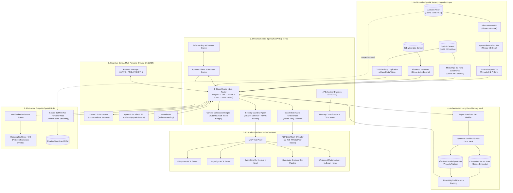

# J.A.R.V.I.S. Master System Specification v3.0 (Stark Horizon Architecture)
### *"The Mark LXXXV Specification: Dynamic, Sovereign, Multi-Agent Swarm, 3D Spatial & Scale-Out Mesh System"*

**System Name:** J.A.R.V.I.S. (Just A Rather Very Intelligent System)  
**System Owner:** Dhamodran Prasath C M | **Persona Standard:** Tony Stark's J.A.R.V.I.S.  
**Architecture Standard:** 8 Systems Engineering Disciplines + 10 Core Stark Sectors + 7 Advanced Horizon Capabilities  
**Hardware Host Baseline:** Intel Core i7-1255U (2 P-Cores + 8 E-Cores, 12 Threads) | Intel Iris Xe GPU (96 EUs) | 16 GB Shared DDR4 | 1 TB NVMe SSD  
**Scalability Engine:** Dynamic Single-Node to Multi-Node Local Mesh (P2P LAN / Wi-Fi 6 RPC compute scaling)  
**Dynamic Policy:** 0% hardcoded paths/IPs (`JARVIS_ROOT`, `JARVIS_DATA_DIR`, `Path.home()`, `0.0.0.0` socket binding)

---

## 1. Dynamic Environment & Scalable System Topology

J.A.R.V.I.S. initializes through an environment-aware, dynamic discovery layer that adapts automatically to any host environment without hardcoded configuration paths:



---

## 2. Dynamic Hardware & Environment Discovery Module

```python
# jarvis/config_dynamic.py — Dynamic System Topology & Environment Discovery
import os, sys, platform, psutil, socket, ctypes
from pathlib import Path

class DynamicSystemConfig:
    """
    Dynamic environment resolver. Eliminates static hardcoding of paths, usernames,
    IP addresses, and hardware limits. Automatically profiles host capabilities.
    """
    def __init__(self):
        # Dynamic Directory Resolution
        self.root_dir = Path(os.getenv("JARVIS_ROOT", Path(__file__).resolve().parent.parent))
        self.data_dir = Path(os.getenv("JARVIS_DATA_DIR", self.root_dir / "data"))
        self.logs_dir = Path(os.getenv("JARVIS_LOG_DIR", self.data_dir / "logs"))
        self.backups_dir = Path(os.getenv("JARVIS_BACKUP_DIR", self.data_dir / "backups"))
        self.vault_dir = Path(os.getenv("JARVIS_VAULT_DIR", self.data_dir / "vault"))
        self.user_home = Path.home()

        # Create required directories dynamically
        for folder in [self.data_dir, self.logs_dir, self.backups_dir, self.vault_dir]:
            folder.mkdir(parents=True, exist_ok=True)

        # Dynamic Network Resolution
        self.host_ip = os.getenv("JARVIS_HOST", "127.0.0.1")
        self.fastapi_port = int(os.getenv("JARVIS_PORT", "8765"))
        self.ollama_port = int(os.getenv("OLLAMA_PORT", "11434"))
        self.n8n_port = int(os.getenv("N8N_PORT", "5678"))
        self.local_lan_ip = self._discover_lan_ip()

        # Dynamic Hardware Profile
        self.cpu_logical = psutil.cpu_count(logical=True)
        self.cpu_physical = psutil.cpu_count(logical=False)
        self.total_ram_gb = round(psutil.virtual_memory().total / (1024**3), 2)
        self.available_ram_gb = round(psutil.virtual_memory().available / (1024**3), 2)
        
        # Calculated RAM Allocation Ceiling (Leaves 1.5 GB for OS)
        self.ram_ceiling_gb = max(4.0, self.total_ram_gb - 1.5)

    def _discover_lan_ip(self) -> str:
        s = socket.socket(socket.AF_INET, socket.SOCK_DGRAM)
        try:
            s.connect(("10.255.255.255", 1))
            ip = s.getsockname()[0]
        except Exception:
            ip = "127.0.0.1"
        finally:
            s.close()
        return ip

    def to_dict(self) -> dict:
        return {
            "root_dir": str(self.root_dir),
            "data_dir": str(self.data_dir),
            "logs_dir": str(self.logs_dir),
            "host_ip": self.host_ip,
            "lan_ip": self.local_lan_ip,
            "fastapi_endpoint": f"http://{self.host_ip}:{self.fastapi_port}",
            "ollama_endpoint": f"http://{self.host_ip}:{self.ollama_port}",
            "n8n_endpoint": f"http://{self.host_ip}:{self.n8n_port}",
            "cpu_topology": f"{self.cpu_physical} Physical / {self.cpu_logical} Logical",
            "ram_total": f"{self.total_ram_gb} GB",
            "ram_ceiling": f"{self.ram_ceiling_gb} GB"
        }

config = DynamicSystemConfig()
```

---

## 3. Future Scalability Blueprint (Tony Stark Scale-Out Model)

J.A.R.V.I.S. v3.0 is engineered with a **Modular Scale-Out Design Pattern**, enabling frictionless expansion across 3 scalability tiers:

```
[Tier 1: Single-Node Sovereign Assistant]
  - Physical Laptop (HP Pavilion i7-1255U / 16GB RAM)
  - Runs local SLMs (Llama 3.2 3B, Qwen 2.5 Coder 1.5B)
  - Local stdio MCP tools + Everything CLI + PySide6 HUD
  
                       │ Scale-Out Expansion (Zero Code Rewrite)
                       ▼
[Tier 2: LAN Multi-Node Compute Mesh]
  - Primary Host (Laptop) + Secondary GPU Node (Desktop NVIDIA GPU)
  - Auto mDNS peer discovery over Wi-Fi 6 / 2.5GbE LAN
  - Thermal / RAM pressure triggers RPC offloading (< 8ms hop)
  
                       │ Scale-Out Expansion (Enterprise Cluster)
                       ▼
[Tier 3: Multi-Agent Distributed Swarm Cluster]
  - Swarm sub-agents execute across 10+ worker nodes in parallel
  - House Party Protocol DAG orchestrator
  - High-throughput vector/graph sharding across nodes
```

### Scalability Principles Applied:
1. **Stateless Agent Worker Pattern**: All specialized agents communicate via standard REST/WebSocket or JSON-RPC 2.0 interfaces, allowing any agent to be moved to a remote process or remote machine without breaking system state.
2. **Dynamic Service Discovery**: Tools and secondary nodes auto-register at startup via standard mDNS / stdio manifests, requiring zero code changes to add new capability modules.
3. **Pluggable Skill/Agent Architecture**: Adding a new skill requires only placing a new `.md` file in `skills/` or a new agent file in `agents/`; the system auto-indexes and binds it via `HybridIntentRouter`.

---

## 4. Complete System Inventory (57 Specifications)

- **Foundation Specifications**: [SETUP_COMMANDS.md](file:///e:/J.A.R.V.I.S%20-%20Upgraded/SETUP_COMMANDS.md), [SYSTEM_SPECIFICATION.md](file:///e:/J.A.R.V.I.S%20-%20Upgraded/SYSTEM_SPECIFICATION.md)
- **Master Blueprint**: [systems_engineering_master_blueprint.md](file:///e:/J.A.R.V.I.S%20-%20Upgraded/skills/systems_engineering_master_blueprint.md)
- **Master Skill Index (28 Skills)**: [skills.md](file:///e:/J.A.R.V.I.S%20-%20Upgraded/skills/skills.md)
- **Master Agent Index (25 Agents)**: [agents.md](file:///e:/J.A.R.V.I.S%20-%20Upgraded/agents/agents.md)
- **Task Tracker**: [task.md](file:///C:/Users/dhamo/.gemini/antigravity-ide/brain/7b92c801-c1c4-4929-8413-52a6c989fd73/task.md)
