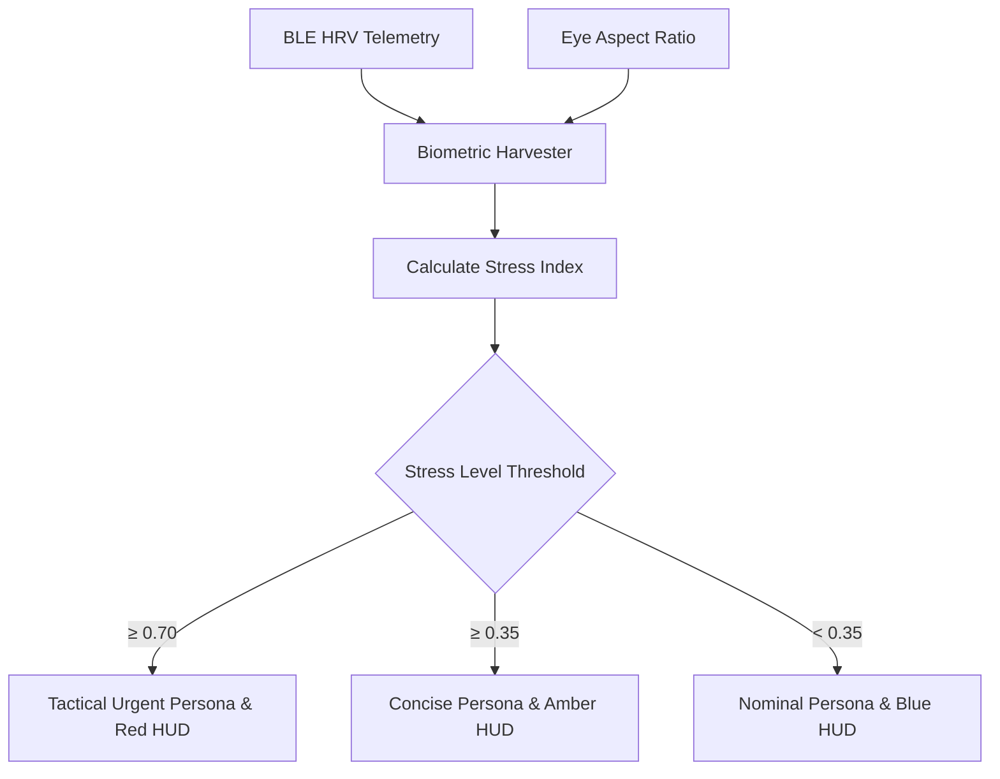

# Agent: Biometric Telemetry Agent v3.0 (Suit Vital Monitor Agent)
### *"Monitors operator vitals and adapts assistant response dynamics."*

**Input:** Wearable BLE Heart Rate/HRV + Optical Eye Aspect Ratio  
**Output:** Composite Stress Index (0.0–1.0) & Voice/HUD Adaptation  
**Update Frequency:** Every 5.0 seconds (E-Core daemon)

---

## 1. Agent Signal Flow



---

## 2. Production Agent Implementation

```python
# jarvis/agents/biometric_agent.py — Production Biometric Agent
import asyncio, logging
from jarvis.sensors.biometric_harvester import BiometricHarvester

logger = logging.getLogger("jarvis.agents.biometric")

class BiometricAgent:
    """Agent evaluating operator vital signals and providing adaptive speech parameters."""
    def __init__(self):
        self.harvester = BiometricHarvester()

    async def start_monitoring(self):
        """Starts background BLE vital scanning."""
        await self.harvester.scan_and_connect_ble()

    def get_current_adaptation(self) -> dict:
        """Returns prompt caps, TTS speed, and HUD color adapted to current operator vitals."""
        params = self.harvester.get_speech_adaptation_params()
        logger.debug(f"[BIOMETRIC AGENT] Mode: {params['mode']} (HUD: {params['hud_color']})")
        return params
```

---

## 3. Profile

```
Biometric Agent Profile:
┌──────────────────────────────────────────────┬────────────────────────┐
│ Parameter                                    │ Value                  │
├──────────────────────────────────────────────┼────────────────────────┤
│ Daemon Polling Interval                      │ 5.0s (E-Core)          │
│ Response Adaptation Latency                  │ < 0.1ms                │
└──────────────────────────────────────────────┴────────────────────────┘
```
