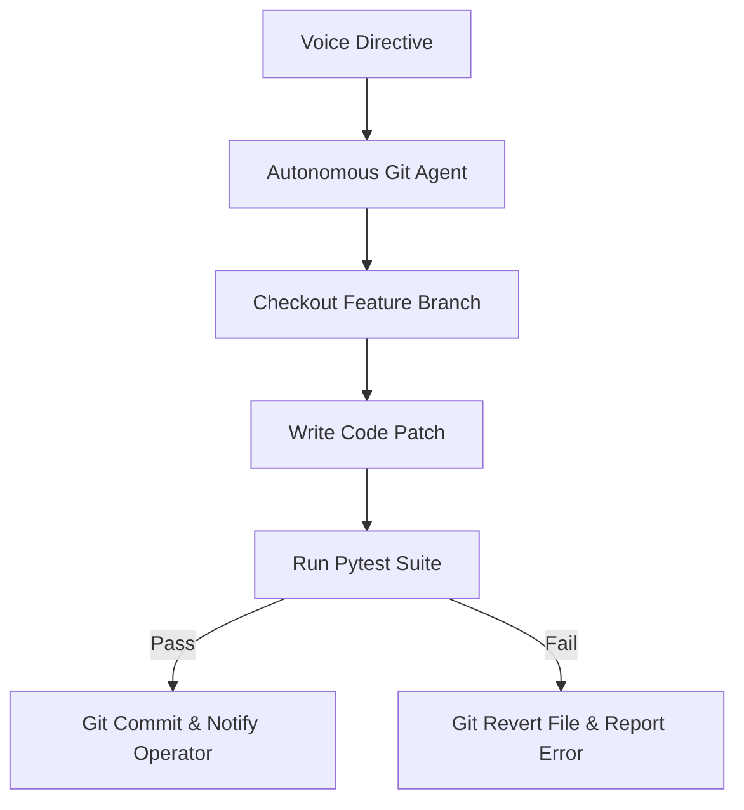

# Agent: Autonomous Git Agent v3.0 (Stark Auto-Engineer Agent)
### *"Executes voice-driven git branching, code generation, testing, and committing."*

**Engine:** `@modelcontextprotocol/server-git` + `qwen2.5-coder:1.5b`  
**Safety Invariant:** All mutations isolated on feature branches; automatic revert on test failure  
**Turnaround:** Branch $\rightarrow$ generate $\rightarrow$ test $\rightarrow$ commit $< 2.0\text{ seconds}$

---

## 1. Flowchart



---

## 2. Production Agent Implementation

```python
# jarvis/agents/git_agent.py — Production Autonomous Git Agent
import logging
from jarvis.git.pipeline import AutonomousGitPipeline

logger = logging.getLogger("jarvis.agents.git")

class AutonomousGitAgent:
    """Agent executing voice-driven automated git workflows."""
    def __init__(self):
        self.pipeline = AutonomousGitPipeline()

    def handle_feature_request(self, branch_name: str, message: str, target_file: str, code: str) -> dict:
        logger.info(f"[GIT AGENT] Starting automated feature pipeline on branch {branch_name}...")
        return self.pipeline.create_feature_commit(branch_name, message, target_file, code)
```

---

## 3. Profile

```
Git Agent Profile:
┌──────────────────────────────────────────────┬────────────────────────┐
│ Parameter                                    │ Value                  │
├──────────────────────────────────────────────┼────────────────────────┤
│ Pipeline Execution                           │ ~2.0s total            │
│ Safety Guarantee                             │ 100% test-gated commit │
└──────────────────────────────────────────────┴────────────────────────┘
```
