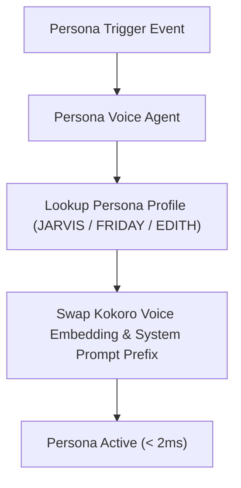

# Agent: Persona Voice Agent v3.0 (Stark Multi-Persona Agent)
### *"Manages dynamic voice persona switching for speech synthesis and LLM prompting."*

**Supported Personas:** J.A.R.V.I.S., F.R.I.D.A.Y., E.D.I.T.H.  
**Switching Time:** $< 2.0\text{ ms}$ (zero model weight reload — voice embedding vector swap)  
**Trigger:** Voice command ("switch to Friday") OR context event (security alert)

---

## 1. Flowchart



---

## 2. Production Agent Implementation

```python
# jarvis/agents/persona_agent.py — Production Persona Voice Agent
import logging
from jarvis.audio.persona_manager import PersonaManager

logger = logging.getLogger("jarvis.agents.persona")

class PersonaVoiceAgent:
    """Agent managing dynamic persona switching for speech and prompt prefixes."""
    def __init__(self, default_persona: str = "JARVIS"):
        self.manager = PersonaManager(default_persona)

    def set_persona(self, persona_name: str) -> dict:
        profile = self.manager.switch_persona(persona_name)
        logger.info(f"[PERSONA AGENT] Active persona set to {profile.name} (Voice: {profile.voice_embedding_id})")
        return {
            "active_persona": profile.name,
            "voice_embedding_id": profile.voice_embedding_id,
            "system_prefix": profile.system_prompt_prefix
        }
```

---

## 3. Profile

```
Persona Agent Profile:
┌──────────────────────────────────────────────┬────────────────────────┐
│ Parameter                                    │ Value                  │
├──────────────────────────────────────────────┼────────────────────────┤
│ Persona Swap Time                            │ < 2.0ms                │
│ Supported Personas                           │ JARVIS, FRIDAY, EDITH  │
└──────────────────────────────────────────────┴────────────────────────┘
```
