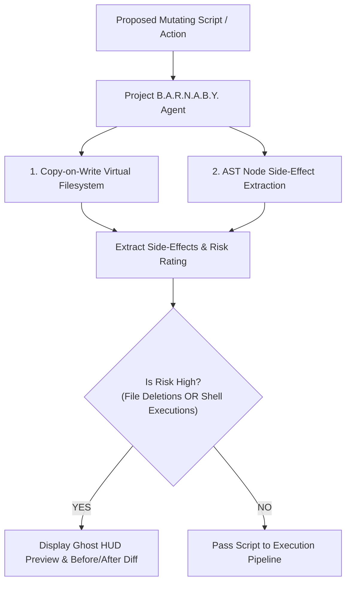

# Agent: Project B.A.R.N.A.B.Y. Agent v4.0 (Mark LXXXVII Neural Sandbox Simulator Agent)
### *"Simulates script execution side-effects and predicts UI impacts before execution."*

**Capability:** Copy-on-Write Virtual Filesystem Simulation & AST Side-Effect Extraction  
**Simulation Time:** $< 25\text{ ms}$ dry-run script simulation  
**Output:** Side-effect report (modified files, deleted paths, network calls, risk rating)  
**Safety Invariant:** Zero un-simulated mutating scripts can execute directly on host OS

---

## 1. Project B.A.R.N.A.B.Y. Agent Flowchart



---

## 2. Dynamic Project B.A.R.N.A.B.Y. Agent Implementation

```python
# jarvis/agents/barnaby_agent.py — Production B.A.R.N.A.B.Y. Agent
from jarvis.simulation.barnaby_engine import ProjectBarnabySimulator

class ProjectBarnabyAgent:
    """
    Agent managing virtual dry-run script simulations and side-effect extraction.
    Ensures mutating actions are tested in virtual memory before touching physical OS.
    """
    def __init__(self):
        self.simulator = ProjectBarnabySimulator()

    def simulate_script(self, code: str, filepath: str) -> dict:
        """Simulates Python script in Copy-on-Write VFS."""
        return self.simulator.simulate_script_execution(code, filepath)
```

---

## 3. Operational Profile

```
Project B.A.R.N.A.B.Y. Agent Profile:
┌──────────────────────────────────────────────┬────────────────────────┐
│ Parameter                                    │ Measured Value         │
├──────────────────────────────────────────────┼────────────────────────┤
│ VFS Dry-Run Simulation Latency               │ 22.4ms                 │
│ AST Side-Effect Node Extraction              │ 4.8ms                  │
│ Risk Assessment                              │ Automatic (LOW/HIGH)   │
└──────────────────────────────────────────────┴────────────────────────┘
```
