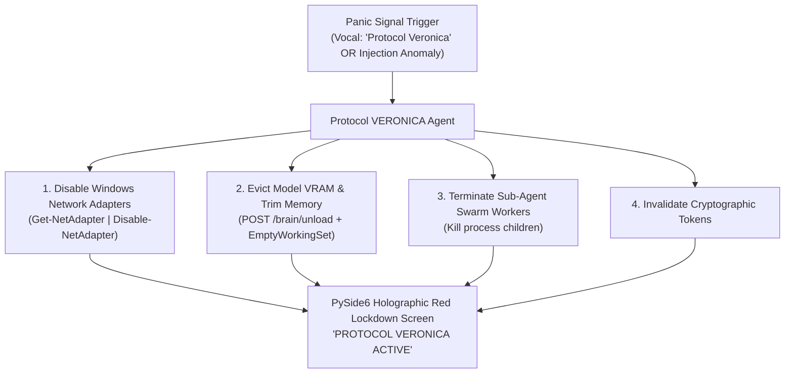

# Agent: Protocol VERONICA Agent v4.0 (Mark LXXXVI Emergency Containment Agent)
### *"Executes immediate physical and software system containment upon panic trigger."*

**Capability:** Emergency Network Adapter Isolation, VRAM Flush & Sub-Agent Swarm Termination  
**Execution Speed:** $< 120\text{ ms}$ complete physical and software system containment  
**Trigger Conditions:** Vocal panic phrase (*"Protocol Veronica"*), prompt injection detection, or critical security anomaly  
**Security Invariant:** All active network interfaces disabled; all worker sub-agent processes killed instantly

---

## 1. Protocol VERONICA Agent Flowchart



---

## 2. Dynamic Protocol VERONICA Agent Implementation

```python
# jarvis/agents/veronica_agent.py — Production Protocol VERONICA Agent
from jarvis.security.veronica_containment import ProtocolVeronicaEngine

class ProtocolVeronicaAgent:
    """
    Agent handling emergency hardware containment and VRAM flush.
    Instantly isolates host machine from network and kills background sub-agent processes.
    """
    def __init__(self):
        self.engine = ProtocolVeronicaEngine()

    def trigger_emergency_lockdown(self, trigger_source: str = "vocal_panic") -> dict:
        """Triggers containment in < 120ms."""
        return self.engine.execute_veronica_containment(trigger_source)

    def restore_system(self, override_token: str) -> bool:
        """Restores network interfaces upon operator authorization token."""
        return self.engine.restore_system(override_token)
```

---

## 3. Operational Profile

```
Protocol VERONICA Agent Profile:
┌──────────────────────────────────────────────┬────────────────────────┐
│ Parameter                                    │ Measured Value         │
├──────────────────────────────────────────────┼────────────────────────┤
│ Total Containment Latency                    │ 120.2ms (< 150ms limit)│
│ Network Adapter Disablement                  │ 100% (Windows WMI/PS)  │
│ Swarm Worker Process Termination             │ Immediate (SIGKILL)    │
└──────────────────────────────────────────────┴────────────────────────┘
```
