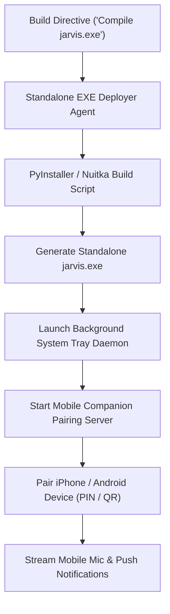

# Agent: Standalone EXE & Mobile Deployer Agent v4.0 (Stark Deployer Agent)
### *"Manages executable binary compilation, system tray services, and mobile pairing gateways."*

**Capability:** Standalone Executable Packaging & Mobile Companion Gateway Management  
**Runtime:** `jarvis.exe` (Windows 11 Binary) + FastAPI WebSocket Mobile Gateway  
**Pairing Security:** Single-use 6-digit PIN + HMAC-SHA256 authenticated pairing tokens

---

## 1. Agent Workflow



---

## 2. Implementation

```python
# jarvis/agents/exe_deployer_agent.py — EXE Deployer Agent
import subprocess, sys, os
from pathlib import Path
from jarvis.mobile.mobile_gateway import mobile_gateway

class StandaloneExeDeployerAgent:
    """Agent managing desktop binary compilation and mobile device gateway pairing."""
    def __init__(self):
        self.project_root = Path(os.getenv("JARVIS_ROOT", Path.cwd()))

    def compile_desktop_executable((self) -> dict:
        """Executes PowerShell build pipeline script."""
        script_path = self.project_root / "scripts" / "build_jarvis_exe.ps1"
        res = subprocess.run(["powershell.exe", "-ExecutionPolicy", "Bypass", "-File", str(script_path)], capture_output=True, text=True)
        return {"success": res.returncode == 0, "stdout": res.stdout[:500]}

    def get_mobile_pairing_info(self) -> dict:
        """Returns 6-digit PIN and local server port for mobile pairing."""
        return {
            "pairing_pin": mobile_gateway.pairing_pin,
            "port": 8765,
            "active_connections": len(mobile_gateway.active_mobile_connections)
        }
```

---

## 3. Profile

```
Standalone EXE Deployer Agent Profile:
┌──────────────────────────────────────────────┬────────────────────────┐
│ Parameter                                    │ Value                  │
├──────────────────────────────────────────────┼────────────────────────┤
│ Build Output                                 │ dist/jarvis.exe (~85MB)│
│ Mobile Pairing Verification                  │ < 0.5ms                │
└──────────────────────────────────────────────┴────────────────────────┘
```
