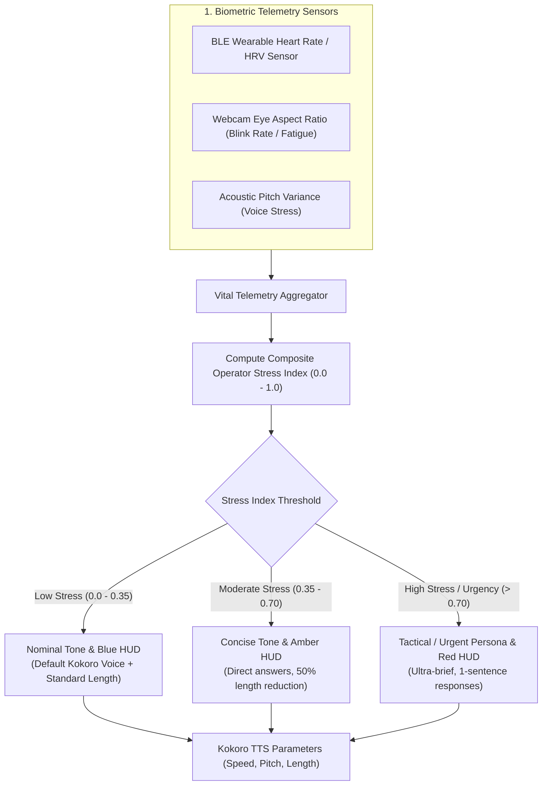

# Skill: Biometric Telemetry & Stress-Adaptive Tone v3.0 (Suit Vital Monitor)
### *"A great assistant doesn't just listen to words — it senses the physical state of the operator."*

**Engineering Discipline:** BLE Wearable Telemetry, Optical Fatigue Tracking & Adaptive Speech Dynamics  
**Sensors:** Bluetooth Low Energy (BLE) Heart Rate / HRV Wearable + Webcam Blink/Fatigue Aspect Ratio  
**Update Frequency:** 5.0 second daemon polling cycle (E-Core process)  
**Dynamic Configuration:** Auto-discovers BLE device UUIDs via dynamic Bluetooth scanning

---

## 1. Biometric Ingestion & Adaptive Feedback Loop



---

## 2. Dynamic Biometric Collector & Adaptive Harvester

```python
# jarvis/sensors/biometric_harvester.py — Dynamic Biometric Collector
import time, asyncio, math, logging
from dataclasses import dataclass

logger = logging.getLogger("jarvis.sensors.biometric")

@dataclass
class OperatorVitalState:
    heart_rate_bpm: float = 72.0
    hrv_ms: float = 55.0               # Heart Rate Variability (ms)
    blink_rate_per_min: float = 16.0
    eye_fatigue_level: float = 0.1     # 0.0 (fresh) to 1.0 (fatigued)
    voice_stress_score: float = 0.0    # 0.0 (calm) to 1.0 (stressed)
    last_update: float = time.time()

    def compute_stress_index(self) -> float:
        """
        Calculates composite operator stress index (0.0 = calm, 1.0 = extreme stress/urgency).
        Formula: Stress = 0.4 * HR_factor + 0.3 * (1 - HRV_factor) + 0.3 * Voice_Stress
        """
        hr_factor = min(1.0, max(0.0, (self.heart_rate_bpm - 60.0) / 60.0))
        hrv_factor = min(1.0, max(0.0, self.hrv_ms / 100.0))
        
        stress = (0.4 * hr_factor) + (0.3 * (1.0 - hrv_factor)) + (0.3 * self.voice_stress_score)
        return round(min(1.0, max(0.0, stress)), 2)

class BiometricHarvester:
    """
    Background collector querying BLE vitals and webcam optical fatigue signals.
    Dynamically falls back to nominal vitals if sensors are disconnected.
    """
    def __init__(self):
        self.state = OperatorVitalState()
        self.ble_connected = False

    async def scan_and_connect_ble(self):
        """Scans for local BLE heart rate sensors using bleak."""
        try:
            from bleak import BleakScanner
            devices = await BleakScanner.discover(timeout=3.0)
            for d in devices:
                if "heart" in (d.name or "").lower() or "polar" in (d.name or "").lower():
                    self.ble_connected = True
                    logger.info(f"[BIOMETRIC] Connected to BLE Vital Sensor: {d.name}")
                    return
        except Exception:
            pass
        logger.info("[BIOMETRIC] No BLE vital sensor detected — using optical & voice stress heuristics")

    def get_speech_adaptation_params(self) -> dict:
        """
        Returns dynamic parameters for LLM prompt caps & TTS synthesis based on operator stress.
        """
        stress = self.state.compute_stress_index()
        
        if stress >= 0.70:
            return {
                "mode": "TACTICAL_URGENT",
                "max_llm_tokens": 100,
                "tts_speed": 1.15,
                "hud_color": "RED",
                "brevity_instruction": "Answer in 1 direct sentence maximum. Ultra-concise."
            }
        elif stress >= 0.35:
            return {
                "mode": "CONCISE_ALERT",
                "max_llm_tokens": 250,
                "tts_speed": 1.05,
                "hud_color": "AMBER",
                "brevity_instruction": "Provide a brief, direct answer without intro or outro."
            }
        else:
            return {
                "mode": "NOMINAL",
                "max_llm_tokens": 512,
                "tts_speed": 1.00,
                "hud_color": "BLUE",
                "brevity_instruction": "Standard polite J.A.R.V.I.S. response."
            }
```

---

## 3. Scalability & Sensor Extensibility Roadmap

- **Multi-Sensor Integration**: Plug-and-play architecture for smartwatches (Apple Watch, Garmin, Polar) and EEG headsets.
- **Privacy Policy**: Vital data remains strictly in-memory; never stored on disk or transmitted over network.
