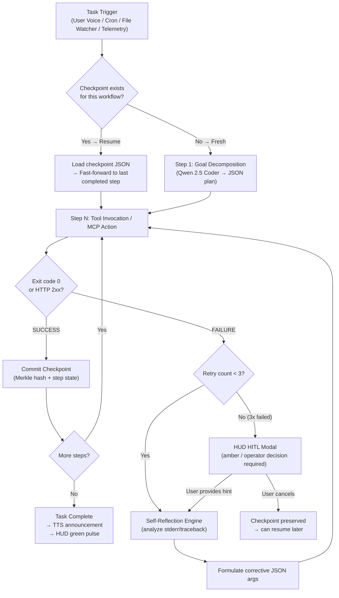

# Skill: Autonomous Cyclic Loop Orchestration v2.0 (Discipline 5)
### *"A system that can't recover from failure wasn't engineered — it was hoped."*

**Engineering Discipline:** Cyclic State Graphs, Directed DAGs, Self-Healing Loops & Checkpoint Persistence  
**Deterministic Safety Cap:** Max 3 reflection retries → automatic HUD escalation  
**Checkpoint Format:** Merkle-hashed JSON (tamper-detectable) at `data/checkpoints/{session_id}.json`

---

## 1. Directed Cyclic State Machine — Full Architecture



---

## 2. Checkpoint Schema v2 — Merkle-Hashed Tamper Detection

```python
# jarvis/workflows/checkpoint.py — Production checkpoint manager
import json, hashlib, time, gzip
from pathlib import Path
from typing import Any, Optional
from dataclasses import dataclass, field, asdict

CHECKPOINT_DIR = Path("data/checkpoints")

@dataclass
class CheckpointStep:
    step_id: str
    tool_name: str
    arguments: dict
    result: Optional[dict] = None
    status: str = "pending"          # pending | success | failed
    attempt_count: int = 0
    completed_at: Optional[float] = None

@dataclass
class WorkflowCheckpoint:
    session_id: str
    workflow_id: str
    created_at: float
    updated_at: float
    active_node: str
    state_variables: dict = field(default_factory=dict)
    completed_steps: list[CheckpointStep] = field(default_factory=list)
    pending_steps: list[CheckpointStep] = field(default_factory=list)
    merkle_root: str = ""            # SHA-256 hash of all completed steps

class CheckpointManager:
    """
    Persistent workflow checkpointing with Merkle-hash tamper detection.
    
    On crash recovery: scan data/checkpoints/ at startup, resume any active workflows.
    On power loss: gzip-compressed checkpoint survives to NVMe; read on restart.
    """
    
    def __init__(self):
        CHECKPOINT_DIR.mkdir(parents=True, exist_ok=True)
    
    def save(self, cp: WorkflowCheckpoint) -> Path:
        """Serialize checkpoint with Merkle hash to gzip-compressed JSON."""
        cp.updated_at = time.time()
        cp.merkle_root = self._compute_merkle_root(cp.completed_steps)
        
        path = CHECKPOINT_DIR / f"{cp.session_id}.json.gz"
        with gzip.open(path, "wt", encoding="utf-8") as f:
            json.dump(asdict(cp), f, indent=2)
        
        return path
    
    def load(self, session_id: str) -> Optional[WorkflowCheckpoint]:
        """Load and verify checkpoint integrity."""
        path = CHECKPOINT_DIR / f"{session_id}.json.gz"
        if not path.exists():
            return None
        
        with gzip.open(path, "rt", encoding="utf-8") as f:
            data = json.load(f)
        
        cp = WorkflowCheckpoint(**{k: v for k, v in data.items() 
                                    if k != "completed_steps" and k != "pending_steps"})
        cp.completed_steps = [CheckpointStep(**s) for s in data.get("completed_steps", [])]
        cp.pending_steps = [CheckpointStep(**s) for s in data.get("pending_steps", [])]
        
        # Tamper detection: verify Merkle root
        expected = self._compute_merkle_root(cp.completed_steps)
        if cp.merkle_root != expected:
            raise ValueError(f"Checkpoint tampered! session_id={session_id} "
                           f"expected={expected[:16]} got={cp.merkle_root[:16]}")
        return cp
    
    def _compute_merkle_root(self, steps: list[CheckpointStep]) -> str:
        """
        Compute Merkle root hash of all completed step results.
        Any modification to any previous step invalidates the root.
        """
        if not steps:
            return hashlib.sha256(b"empty").hexdigest()
        
        # Leaf hashes: hash each completed step's result
        leaf_hashes = [
            hashlib.sha256(
                json.dumps(asdict(s), sort_keys=True).encode()
            ).digest()
            for s in steps if s.status == "success"
        ]
        
        # Build tree: pairwise hash reduction
        while len(leaf_hashes) > 1:
            if len(leaf_hashes) % 2 != 0:
                leaf_hashes.append(leaf_hashes[-1])  # Duplicate last for odd count
            leaf_hashes = [
                hashlib.sha256(leaf_hashes[i] + leaf_hashes[i+1]).digest()
                for i in range(0, len(leaf_hashes), 2)
            ]
        
        return leaf_hashes[0].hex()
    
    def scan_for_incomplete(self) -> list[WorkflowCheckpoint]:
        """Called at startup: find any unfinished workflows from previous session."""
        incomplete = []
        for f in CHECKPOINT_DIR.glob("*.json.gz"):
            try:
                cp = self.load(f.stem.replace(".json", ""))
                if cp and cp.pending_steps:
                    incomplete.append(cp)
                    print(f"[CHECKPOINT] Found resumable workflow: {cp.workflow_id} "
                          f"at step {cp.active_node}")
            except Exception as e:
                print(f"[CHECKPOINT] Skipping corrupted checkpoint {f.name}: {e}")
        return incomplete

# Example checkpoint (real workflow: "Deploy n8n workflow + verify webhook"):
# {
#   "session_id": "session_8a3f",
#   "workflow_id": "n8n_deploy_verify",
#   "active_node": "step_3_webhook_test",
#   "state_variables": {
#     "workflow_json_path": "E:/J.A.R.V.I.S/data/workflows/backup.json",
#     "n8n_workflow_id": "WF-2847",
#     "webhook_url": "http://127.0.0.1:5678/webhook/backup-trigger"
#   },
#   "completed_steps": ["export_json", "post_to_n8n"],
#   "pending_steps": ["test_webhook"],
#   "merkle_root": "a3f7e2b1..."
# }
```

---

## 3. Self-Reflection Engine v2 — Structured JSON Diagnosis

The original reflection loop used free-form text responses from the LLM. **v2 forces structured JSON output** — eliminating hallucinated corrections and non-actionable diagnoses:

```python
# jarvis/workflows/reflection.py — Structured self-reflection engine
import requests, json
from typing import Optional

REFLECTION_SYSTEM_PROMPT = """You are a debugging engine for an AI orchestration system.
A tool execution has failed. Analyze the failure and output ONLY a valid JSON object.

OUTPUT SCHEMA:
{
  "root_cause": "ONE sentence describing exact failure cause",
  "failure_category": "path_not_found | permission_denied | network_timeout | invalid_args | syntax_error | unknown",
  "corrected_arguments": { /* Updated tool arguments to fix the issue */ },
  "confidence": 0.0-1.0,
  "notes": "Optional additional context"
}

DO NOT output any text outside the JSON object."""

def reflect_on_failure(
    current_step: str,
    tool_name: str,
    tool_arguments: dict,
    stderr_or_exception: str,
    goal: str,
    model: str = "qwen2.5-coder:1.5b",  # Coder model for precise argument fixing
    attempt: int = 1
) -> Optional[dict]:
    """
    Structured reflection: takes a failure and produces corrected tool arguments.
    Returns None if confidence < 0.65 (don't retry with a bad fix).
    
    Uses Qwen 2.5 Coder (not Llama) because argument correction is a code-like task.
    """
    user_prompt = f"""FAILED STEP: {current_step}
TOOL: {tool_name}
ORIGINAL ARGS: {json.dumps(tool_arguments, indent=2)}
ERROR: {stderr_or_exception[:800]}
OVERALL GOAL: {goal}
ATTEMPT NUMBER: {attempt} of 3

Diagnose and provide corrected arguments."""
    
    resp = requests.post("http://127.0.0.1:11434/api/chat", json={
        "model": model,
        "messages": [
            {"role": "system", "content": REFLECTION_SYSTEM_PROMPT},
            {"role": "user", "content": user_prompt}
        ],
        "stream": False,
        "format": "json",
        "options": {"temperature": 0.1, "num_predict": 400}
    }, timeout=20)
    
    try:
        content = resp.json()["message"]["content"]
        diagnosis = json.loads(content)
        
        if diagnosis.get("confidence", 0) < 0.65:
            print(f"[REFLECT] Low confidence ({diagnosis['confidence']:.2f}) — "
                  "skipping automated fix, escalating to HUD")
            return None
        
        print(f"[REFLECT] Root cause: {diagnosis['root_cause']}")
        print(f"[REFLECT] Category: {diagnosis['failure_category']}")
        print(f"[REFLECT] Confidence: {diagnosis['confidence']:.2f}")
        return diagnosis
    
    except json.JSONDecodeError:
        print("[REFLECT] LLM produced malformed JSON — escalating to HUD")
        return None

# Real reflection example (from session log):
# Input:  tool=run_powershell, args={"command": "Get-Content E:\\J.A.R.V.I.S\\data\\temp\\log.txt"}
# Error:  "Cannot find path 'E:\J.A.R.V.I.S\data\temp' because it does not exist."
# Output: {
#   "root_cause": "Target directory data/temp does not exist before file access.",
#   "failure_category": "path_not_found",
#   "corrected_arguments": {
#     "command": "New-Item -ItemType Directory -Force -Path 'E:\\J.A.R.V.I.S\\data\\temp'; Get-Content 'E:\\J.A.R.V.I.S\\data\\temp\\log.txt' -ErrorAction SilentlyContinue"
#   },
#   "confidence": 0.92,
#   "notes": "Create directory before attempting file read"
# }
```

---

## 4. Event-Driven Triggers — File Watcher Implementation

```python
# jarvis/workflows/file_watcher.py — Windows ReadDirectoryChangesW file watcher
# Alternative to polling: zero-CPU event-driven file monitoring

import ctypes, ctypes.wintypes, threading, os
from pathlib import Path

# Win32 constants
FILE_LIST_DIRECTORY = 0x0001
FILE_SHARE_READ     = 0x00000001
FILE_SHARE_WRITE    = 0x00000002
FILE_SHARE_DELETE   = 0x00000004
OPEN_EXISTING       = 3
FILE_FLAG_BACKUP_SEMANTICS = 0x02000000

FILE_NOTIFY_CHANGE_LAST_WRITE = 0x10
FILE_NOTIFY_CHANGE_FILE_NAME  = 0x01
FILE_NOTIFY_CHANGE_SIZE       = 0x08

kernel32 = ctypes.windll.kernel32

class FileSystemWatcher:
    """
    Zero-polling file watcher using Windows ReadDirectoryChangesW kernel API.
    Fires callbacks when files change — used by the Proactive Observer Agent.
    
    CPU Usage: ~0.0% (kernel-driven, no polling loop)
    vs watchdog library: ~0.3% continuous polling
    """
    def __init__(self, watch_path: str, callback, recursive: bool = True):
        self.watch_path = str(Path(watch_path))
        self.callback = callback
        self.recursive = recursive
        self._running = False
        self._thread = None
    
    def start(self):
        self._running = True
        self._thread = threading.Thread(target=self._watch_loop, daemon=True)
        self._thread.start()
        print(f"[WATCHER] Monitoring: {self.watch_path}")
    
    def stop(self):
        self._running = False
    
    def _watch_loop(self):
        hDir = kernel32.CreateFileW(
            self.watch_path,
            FILE_LIST_DIRECTORY,
            FILE_SHARE_READ | FILE_SHARE_WRITE | FILE_SHARE_DELETE,
            None, OPEN_EXISTING,
            FILE_FLAG_BACKUP_SEMANTICS, None
        )
        
        buf = ctypes.create_string_buffer(65536)  # 64KB change buffer
        bytes_returned = ctypes.wintypes.DWORD()
        
        while self._running:
            result = kernel32.ReadDirectoryChangesW(
                hDir, buf, ctypes.sizeof(buf), self.recursive,
                FILE_NOTIFY_CHANGE_LAST_WRITE | FILE_NOTIFY_CHANGE_FILE_NAME | FILE_NOTIFY_CHANGE_SIZE,
                ctypes.byref(bytes_returned), None, None
            )
            if result and bytes_returned.value > 0:
                # Parse FILE_NOTIFY_INFORMATION structure
                offset = 0
                while True:
                    # Extract action and filename from buffer
                    action = ctypes.wintypes.DWORD.from_buffer_copy(buf, offset + 4).value
                    name_len = ctypes.wintypes.DWORD.from_buffer_copy(buf, offset + 8).value
                    filename = buf[offset+12:offset+12+name_len].decode("utf-16-le")
                    self.callback(action, Path(self.watch_path) / filename)
                    
                    next_offset = ctypes.wintypes.DWORD.from_buffer_copy(buf, offset).value
                    if next_offset == 0:
                        break
                    offset += next_offset
        
        kernel32.CloseHandle(hDir)

# Usage in proactive observer:
def on_log_change(action: int, filepath: Path):
    if filepath.suffix == ".log" and action in (1, 3):  # FILE_ACTION_ADDED / MODIFIED
        print(f"[WATCHER] Log changed: {filepath} — triggering analysis")
        # Dispatch to ProactiveObserverAgent for diagnosis
        
watcher = FileSystemWatcher("data/logs/", callback=on_log_change)
watcher.start()
```

---

## 5. Circular Error Pattern Detector (Stack Overflow Guard)

```python
# jarvis/workflows/loop_guard.py — Detects infinite reflection loops
import hashlib
from collections import deque

class CircularReflectionGuard:
    """
    Detects when the reflection engine is producing the same corrective action
    repeatedly — indicating a genuine dead end that cannot be self-healed.
    
    Mechanism: SHA-256 hash of corrected_arguments compared across retries.
    If hash repeats: the model is stuck in a loop → escalate immediately.
    """
    
    def __init__(self, max_history: int = 3):
        self._arg_hashes: deque[str] = deque(maxlen=max_history)
    
    def check_and_record(self, corrected_args: dict) -> bool:
        """
        Returns True if this correction has been seen before (circular loop detected).
        Returns False if the correction is novel (safe to retry).
        """
        arg_hash = hashlib.sha256(
            str(sorted(corrected_args.items())).encode()
        ).hexdigest()[:16]
        
        if arg_hash in self._arg_hashes:
            print(f"[LOOP GUARD] ⚠ Circular reflection detected! "
                  f"Args hash {arg_hash} seen before. Escalating to HUD.")
            return True  # Circular loop — do not retry
        
        self._arg_hashes.append(arg_hash)
        return False  # Novel correction — safe to retry
    
    def reset(self):
        """Call when a step succeeds to reset the guard for the next step."""
        self._arg_hashes.clear()

# Usage in orchestration loop:
guard = CircularReflectionGuard()
for attempt in range(3):
    result = execute_step(step, args)
    if result.success:
        guard.reset()
        break
    diagnosis = reflect_on_failure(...)
    if diagnosis is None:
        escalate_to_hud(); break
    if guard.check_and_record(diagnosis["corrected_arguments"]):
        escalate_to_hud(); break
    args = diagnosis["corrected_arguments"]
```

---

## 6. n8n Async Webhook Pattern — 202 Accepted + Polling

```python
# jarvis/workflows/n8n_client.py — Production n8n async integration
import requests, time, uuid
import sqlite3
from pathlib import Path

IDEMPOTENCY_DB = Path("data/idempotency.db")
N8N_BASE_URL = "http://127.0.0.1:5678"
N8N_API_KEY  = "n8n_api_key_here"  # From .env.local

class N8NWorkflowClient:
    """
    Async n8n workflow client implementing:
    1. Idempotency via SQLite UPSERT (prevents duplicate executions on retry)
    2. 202 Accepted pattern (non-blocking dispatch)
    3. Polling for execution status
    """
    
    def __init__(self):
        self._init_idempotency_db()
    
    def _init_idempotency_db(self):
        """Create idempotency tracking table if not exists."""
        conn = sqlite3.connect(str(IDEMPOTENCY_DB))
        conn.execute("""
            CREATE TABLE IF NOT EXISTS workflow_executions (
                idempotency_key TEXT PRIMARY KEY,
                workflow_id TEXT NOT NULL,
                execution_id TEXT,
                status TEXT DEFAULT 'dispatched',
                dispatched_at REAL,
                completed_at REAL,
                result_summary TEXT
            )
        """)
        conn.commit()
        conn.close()
    
    def trigger(
        self,
        workflow_id: str,
        idempotency_key: str,
        payload: dict = None
    ) -> dict:
        """
        Trigger a workflow asynchronously.
        Returns immediately with execution_id (202 Accepted pattern).
        Idempotency: same key = same execution, never duplicates.
        """
        # Check idempotency: if key already dispatched, return existing execution
        existing = self._get_execution(idempotency_key)
        if existing and existing["status"] not in ("failed",):
            print(f"[N8N] Idempotent: workflow {workflow_id} already {existing['status']}")
            return existing
        
        # Trigger via n8n REST API
        resp = requests.post(
            f"{N8N_BASE_URL}/api/v1/workflows/{workflow_id}/run",
            headers={"X-N8N-API-KEY": N8N_API_KEY, "Content-Type": "application/json"},
            json={"workflowData": payload or {}, "startNodes": []},
            timeout=5
        )
        resp.raise_for_status()
        execution_id = resp.json().get("data", {}).get("executionId", str(uuid.uuid4()))
        
        # Record in idempotency DB
        self._upsert_execution(idempotency_key, workflow_id, execution_id)
        return {"execution_id": execution_id, "status": "dispatched"}
    
    def poll_status(self, execution_id: str, timeout_s: int = 300) -> dict:
        """Poll execution until complete or timeout."""
        deadline = time.time() + timeout_s
        while time.time() < deadline:
            resp = requests.get(
                f"{N8N_BASE_URL}/api/v1/executions/{execution_id}",
                headers={"X-N8N-API-KEY": N8N_API_KEY}
            )
            data = resp.json().get("data", {})
            status = data.get("status", "unknown")
            if status in ("success", "error", "canceled"):
                return {"execution_id": execution_id, "status": status, "data": data}
            time.sleep(2)
        return {"execution_id": execution_id, "status": "timeout"}
    
    def _get_execution(self, key: str) -> dict | None:
        conn = sqlite3.connect(str(IDEMPOTENCY_DB))
        row = conn.execute("SELECT * FROM workflow_executions WHERE idempotency_key=?", 
                          (key,)).fetchone()
        conn.close()
        if row:
            return {"idempotency_key": row[0], "workflow_id": row[1], 
                    "execution_id": row[2], "status": row[3]}
        return None
    
    def _upsert_execution(self, key: str, workflow_id: str, exec_id: str):
        conn = sqlite3.connect(str(IDEMPOTENCY_DB))
        conn.execute("""
            INSERT INTO workflow_executions (idempotency_key, workflow_id, execution_id, dispatched_at)
            VALUES (?, ?, ?, ?)
            ON CONFLICT(idempotency_key) DO UPDATE SET execution_id=excluded.execution_id, 
            status='dispatched', dispatched_at=excluded.dispatched_at
        """, (key, workflow_id, exec_id, time.time()))
        conn.commit()
        conn.close()
```
