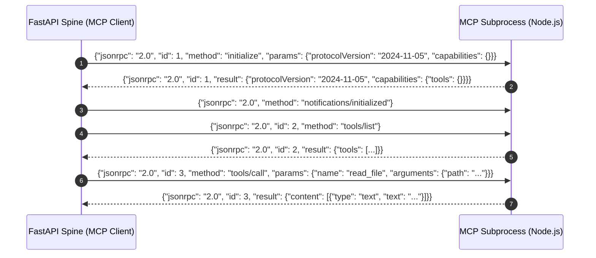

# Skill: Master Catalog of Real-World MCP Server Integrations

**Layer Classification:** Universal Tool Integration Layer  
**Protocol Standard:** Model Context Protocol (MCP) JSON-RPC 2.0 over `stdio` & Server-Sent Events (`SSE`)  
**Host Architecture:** Integrated into FastAPI Spine via asynchronous stdio process pipelines on Windows 11  

---

## 1. Master Real-World MCP Server Roster

J.A.R.V.I.S. avoids fragile bespoke scripts by integrating official, production-tested MCP servers developed by Anthropic, Microsoft, and the open-source MCP community:

| # | MCP Server Name | NPM / Pip Package | Transport | Core Purpose & Capabilities | Memory Footprint |
| :- | :--- | :--- | :--- | :--- | :--- |
| **1** | **Playwright MCP** | `@modelcontextprotocol/server-playwright` | `stdio` | Full web navigation, DOM clicks, form fills, JS evaluation, visual screenshots. | ~350 MB |
| **2** | **Chrome DevTools MCP** | `chrome-devtools-mcp` | `stdio` / `ws` | Live Chrome debugging port control, network request inspection, performance traces. | ~200 MB |
| **3** | **Standard Filesystem MCP**| `@modelcontextprotocol/server-filesystem`| `stdio` | Sandboxed local file reads, batch reads, atomic writes, surgical text patching, tree views. | ~80 MB |
| **4** | **Git Version Control MCP**| `@modelcontextprotocol/server-git` | `stdio` | Local git repository status, diffs, commits, branch management, history logs. | ~50 MB |
| **5** | **SQLite Database MCP** | `@modelcontextprotocol/server-sqlite` | `stdio` | Local SQLite database schema inspection, data querying, read-only analytics. | ~45 MB |
| **6** | **Everything Search MCP** | `everything-search-mcp` (`es.exe`) | `stdio` | Instant (< 5ms) NTFS file discovery across entire 1TB SSD. | ~25 MB |
| **7** | **Fetch Web Reader MCP** | `@modelcontextprotocol/server-fetch` | `stdio` | Lightweight HTTP scraper converting web pages directly into clean Markdown text. | ~60 MB |
| **8** | **Semantic Graph Memory MCP**| `@modelcontextprotocol/server-memory` | `stdio` | Entity-relation knowledge graph store, semantic observation tracking. | ~75 MB |

---

## 2. Production Master Manifest (`mcp_config.json`)

Place this manifest at `<PROJECT_ROOT>/mcp_config.json` for automatic multi-server initialization during boot:

```json
{
  "mcpServers": {
    "playwright": {
      "command": "npx.cmd",
      "args": ["-y", "@modelcontextprotocol/server-playwright"],
      "env": {
        "PLAYWRIGHT_HEADLESS": "true",
        "NODE_OPTIONS": "--max-old-space-size=512"
      }
    },
    "filesystem": {
      "command": "npx.cmd",
      "args": [
        "-y",
        "@modelcontextprotocol/server-filesystem",
        "E:\\J.A.R.V.I.S",
        "C:\\Users\\dhamo\\Documents",
        "E:\\J.A.R.V.I.S\\data"
      ],
      "env": {
        "NODE_OPTIONS": "--max-old-space-size=256"
      }
    },
    "git": {
      "command": "npx.cmd",
      "args": ["-y", "@modelcontextprotocol/server-git", "--repository", "E:\\J.A.R.V.I.S"],
      "env": {
        "NODE_OPTIONS": "--max-old-space-size=128"
      }
    },
    "sqlite": {
      "command": "npx.cmd",
      "args": ["-y", "@modelcontextprotocol/server-sqlite", "--db-path", "E:\\J.A.R.V.I.S\\data\\idempotency.db"],
      "env": {
        "NODE_OPTIONS": "--max-old-space-size=128"
      }
    },
    "fetch": {
      "command": "npx.cmd",
      "args": ["-y", "@modelcontextprotocol/server-fetch"],
      "env": {
        "NODE_OPTIONS": "--max-old-space-size=128"
      }
    }
  }
}
```

---

## 3. Server Specifications & Tool Inventories

### 3.1 Playwright MCP (`@modelcontextprotocol/server-playwright`)
- **Tools:**
  - `playwright_navigate(url: string)`: Opens a webpage.
  - `playwright_screenshot(name: string, selector?: string, fullPage?: boolean)`: Captures page image.
  - `playwright_click(selector: string)`: Clicks button/link.
  - `playwright_fill(selector: string, value: string)`: Enters input text.
  - `playwright_evaluate(script: string)`: Executes client-side JavaScript.

### 3.2 Git MCP (`@modelcontextprotocol/server-git`)
- **Tools:**
  - `git_status()`: Shows staged, unstaged, and untracked changes.
  - `git_diff_unstaged()`, `git_diff_staged()`: Emits unified diff patches.
  - `git_commit(message: string)`: Commits changes. *(Requires HUD approval)*.
  - `git_log(max_count: number)`: Returns commit history.
  - `git_create_branch(branch_name: string)`: Creates local working branch.

### 3.3 SQLite MCP (`@modelcontextprotocol/server-sqlite`)
- **Tools:**
  - `read_query(query: string)`: Executes SQL `SELECT` queries with parameter binding.
  - `write_query(query: string)`: Executes `INSERT`, `UPDATE`, or `DELETE`. *(Requires HUD approval)*.
  - `describe_table(table_name: string)`: Returns column types, constraints, and indexes.
  - `list_tables()`: Enumerates all tables in the SQLite database.

### 3.4 Fetch MCP (`@modelcontextprotocol/server-fetch`)
- **Tools:**
  - `fetch(url: string, max_length?: number, raw?: boolean)`: High-speed GET request converting HTML directly to clean LLM markdown, avoiding the overhead of spinning up a full browser instance.

---

## 4. Stdio JSON-RPC 2.0 Lifecycle Protocol

The FastAPI central spine communicates with each MCP process using standardized JSON-RPC 2.0 over standard streams:


