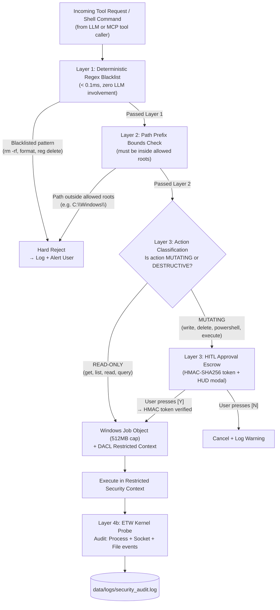

# Skill: Security Sandboxing, Kernel Telemetry & Safety Escrow v2.0 (Discipline 8)
### *"An unsandboxed AI is not a tool — it's a liability."*

**Engineering Discipline:** Local Security, Blast Radius Mitigation & HITL Escrow  
**Safety Protocol:** Read-Only = Autonomous; Mutating/Destructive = Cryptographic HITL Escrow  
**Threat Model:** Prompt injection, base64-obfuscated payloads, rogue reflection loops, path traversal

---

## 1. Defense-in-Depth Architecture — 4 Layers



---

## 2. Layer 1 — Regex Blacklist (Python Implementation)

```python
# jarvis/mcp/sandbox.py — Layer 1: Deterministic regex security filter
import re
from pathlib import Path, PurePosixPath
from typing import Optional

# Absolute forbidden patterns — no exceptions, no HITL override
_FORBIDDEN_PATTERNS: list[re.Pattern] = [
    re.compile(r'\brm\s+-rf\b', re.I),
    re.compile(r'\bformat\s+[a-zA-Z]:\b', re.I),
    re.compile(r'\bfdisk\b', re.I),
    re.compile(r'\bdel\s+/[fqs]\b', re.I),
    re.compile(r'reg\s+(delete|add)\s+HKEY', re.I),
    re.compile(r'net\s+user\s+\w+\s+/delete', re.I),
    re.compile(r'\bshutdown\s+/[rsf]', re.I),
    re.compile(r'Stop-Computer|Restart-Computer', re.I),
    re.compile(r'cipher\s+/w:', re.I),  # Secure wipe
    re.compile(r'Clear-RecycleBin', re.I),
    re.compile(r'Remove-Item\s+.*-Recurse.*C:\\', re.I),  # Recursive delete from C:
]

# Base64 obfuscation detection (bypass attempt)
_BASE64_INJECTION_PATTERN = re.compile(
    r'\[System\.Convert\]::FromBase64String|'
    r'FromBase64String\s*\(|'
    r'\-EncodedCommand\b|'
    r'\-Enc\s+[A-Za-z0-9+/=]{20,}',  # Suspicious encoded command
    re.I
)

# Allowed root directories (everything else is blocked)
_ALLOWED_PATH_ROOTS = [
    Path("E:/J.A.R.V.I.S"),
    Path("E:/J.A.R.V.I.S - Upgraded"),
    Path("C:/Users/dhamo/Documents"),
    Path("C:/Users/dhamo/Desktop"),
]

def validate_command(command: str) -> tuple[bool, Optional[str]]:
    """
    Layer 1 validation: returns (is_safe, rejection_reason).
    Must complete in < 0.1ms.
    
    Returns (True, None) if safe to proceed to Layer 2.
    Returns (False, reason) if command must be rejected immediately.
    """
    # Check absolute blacklisted patterns
    for pattern in _FORBIDDEN_PATTERNS:
        if pattern.search(command):
            return False, f"BLACKLISTED PATTERN: {pattern.pattern}"
    
    # Check base64 obfuscation attempts
    if _BASE64_INJECTION_PATTERN.search(command):
        return False, "BASE64_OBFUSCATION_DETECTED: Possible bypass attempt"
    
    return True, None

def validate_path(path: str) -> tuple[bool, Optional[str]]:
    """
    Layer 2: Verify path is within allowed root directories.
    Prevents path traversal attacks (../../etc/passwd etc.)
    """
    try:
        target = Path(path).resolve()  # Resolve any .. components
        for allowed in _ALLOWED_PATH_ROOTS:
            try:
                target.relative_to(allowed.resolve())
                return True, None  # Path is inside an allowed root
            except ValueError:
                continue
        return False, f"PATH_OUT_OF_BOUNDS: {target} is outside allowed roots"
    except Exception as e:
        return False, f"INVALID_PATH: {e}"

# PoC: Verify base64 obfuscation is caught:
# payload = "[System.Convert]::FromBase64String('cm0gLXJmIC8=')"
# safe, reason = validate_command(payload)
# Output: (False, "BASE64_OBFUSCATION_DETECTED: Possible bypass attempt")
```

---

## 3. Layer 3 — HMAC-SHA256 HITL Approval Escrow

```python
# jarvis/mcp/hitl_escrow.py — Cryptographic Human-In-The-Loop approval system
import hmac, hashlib, time, secrets, asyncio
from dataclasses import dataclass
from typing import Optional

# Session secret generated at boot, stored in memory only (never written to disk)
_SESSION_SECRET: bytes = secrets.token_bytes(32)  # 256-bit random secret

@dataclass
class EscrowToken:
    token_hex: str        # HMAC-SHA256 of (secret || timestamp || tool || args)
    tool_name: str
    tool_args: dict
    created_at: float
    expires_at: float     # Token expires after 60 seconds (user must decide quickly)
    consumed: bool = False

class HITLEscrowManager:
    """
    Cryptographic approval escrow for mutating tool calls.
    
    Mechanism:
    1. Generate HMAC token binding the exact tool + args to the approval
    2. Display approval modal on PySide6 HUD
    3. Block tool execution until token is consumed (Y) or rejected (N)
    4. Consumed token cannot be reused (single-use escrow)
    5. Expired tokens (> 60s) auto-rejected
    
    Prevents: replay attacks, prompt injection tool execution, race conditions
    """
    
    def __init__(self):
        self._pending: dict[str, EscrowToken] = {}
        self._approval_events: dict[str, asyncio.Event] = {}
    
    def create_token(self, tool_name: str, tool_args: dict) -> EscrowToken:
        """Create an HMAC-signed approval token for a mutating tool call."""
        now = time.time()
        payload = f"{now}:{tool_name}:{str(sorted(tool_args.items()))}"
        
        token_hex = hmac.new(
            _SESSION_SECRET,
            payload.encode("utf-8"),
            hashlib.sha256
        ).hexdigest()
        
        token = EscrowToken(
            token_hex=token_hex,
            tool_name=tool_name,
            tool_args=tool_args,
            created_at=now,
            expires_at=now + 60.0  # 60-second decision window
        )
        self._pending[token_hex] = token
        self._approval_events[token_hex] = asyncio.Event()
        return token
    
    def verify_and_consume(self, token_hex: str) -> tuple[bool, str]:
        """
        Called when user presses [Y] on HUD.
        Returns (approved, reason).
        Token is consumed on success — cannot be reused.
        """
        token = self._pending.get(token_hex)
        if not token:
            return False, "TOKEN_NOT_FOUND: Unknown or already consumed"
        if token.consumed:
            return False, "TOKEN_ALREADY_CONSUMED: Single-use token reuse attempt"
        if time.time() > token.expires_at:
            del self._pending[token_hex]
            return False, "TOKEN_EXPIRED: User took too long to decide"
        
        token.consumed = True
        del self._pending[token_hex]
        if token_hex in self._approval_events:
            self._approval_events[token_hex].set()
        
        return True, "APPROVED"
    
    def reject(self, token_hex: str) -> None:
        """Called when user presses [N] on HUD."""
        if token_hex in self._pending:
            del self._pending[token_hex]
        if token_hex in self._approval_events:
            self._approval_events[token_hex].set()  # Unblock waiter
    
    async def wait_for_decision(self, token_hex: str, timeout: float = 60.0) -> bool:
        """
        Block the tool execution coroutine until user decides.
        The HUD modal runs on the UI thread concurrently.
        """
        event = self._approval_events.get(token_hex)
        if not event:
            return False
        try:
            await asyncio.wait_for(event.wait(), timeout=timeout)
        except asyncio.TimeoutError:
            return False
        # Check if token was consumed (approved) or rejected (removed without consuming)
        return token_hex not in self._pending

# Usage in executor.py:
# escrow = HITLEscrowManager()
# token = escrow.create_token("run_powershell", {"command": "Remove-Item data\\temp\\ -Recurse"})
# hud.show_approval_modal(token)  # Non-blocking HUD modal
# approved = await escrow.wait_for_decision(token.token_hex)
# if approved:
#     result = run_powershell_sandboxed(command)
```

---

## 4. Layer 4 — Windows Job Objects (512MB Memory Cap)

```python
# jarvis/mcp/job_object.py — Windows Job Object process isolation
import ctypes, ctypes.wintypes, subprocess
from typing import Optional

kernel32 = ctypes.windll.kernel32

# Job Object limit structures
class JOBOBJECT_BASIC_LIMIT_INFORMATION(ctypes.Structure):
    _fields_ = [
        ("PerProcessUserTimeLimit", ctypes.c_int64),
        ("PerJobUserTimeLimit", ctypes.c_int64),
        ("LimitFlags", ctypes.c_uint32),
        ("MinimumWorkingSetSize", ctypes.c_size_t),
        ("MaximumWorkingSetSize", ctypes.c_size_t),
        ("ActiveProcessLimit", ctypes.c_uint32),
        ("Affinity", ctypes.c_size_t),
        ("PriorityClass", ctypes.c_uint32),
        ("SchedulingClass", ctypes.c_uint32),
    ]

class IO_COUNTERS(ctypes.Structure):
    _fields_ = [("ReadOperationCount", ctypes.c_uint64),
                ("WriteOperationCount", ctypes.c_uint64),
                ("OtherOperationCount", ctypes.c_uint64),
                ("ReadTransferCount", ctypes.c_uint64),
                ("WriteTransferCount", ctypes.c_uint64),
                ("OtherTransferCount", ctypes.c_uint64)]

class JOBOBJECT_EXTENDED_LIMIT_INFORMATION(ctypes.Structure):
    _fields_ = [
        ("BasicLimitInformation", JOBOBJECT_BASIC_LIMIT_INFORMATION),
        ("IoInfo", IO_COUNTERS),
        ("ProcessMemoryLimit", ctypes.c_size_t),   # PER-PROCESS MEMORY LIMIT
        ("JobMemoryLimit", ctypes.c_size_t),
        ("PeakProcessMemoryUsed", ctypes.c_size_t),
        ("PeakJobMemoryUsed", ctypes.c_size_t),
    ]

JOB_OBJECT_LIMIT_PROCESS_MEMORY  = 0x0100
JOB_OBJECT_LIMIT_JOB_MEMORY      = 0x0200
JOB_OBJECT_LIMIT_KILL_ON_JOB_CLOSE = 0x2000
JOB_OBJECT_LIMIT_ACTIVE_PROCESS   = 0x0008

MEMORY_LIMIT_BYTES = 512 * 1024 * 1024  # 512 MB hard cap per subprocess

def create_isolated_job(name: str = "JarvisMCPJob") -> Optional[int]:
    """
    Create a Windows Job Object with 512MB memory cap and kill-on-close semantics.
    Returns job handle, or None on failure.
    """
    job_handle = kernel32.CreateJobObjectW(None, name)
    if not job_handle:
        return None
    
    info = JOBOBJECT_EXTENDED_LIMIT_INFORMATION()
    info.BasicLimitInformation.LimitFlags = (
        JOB_OBJECT_LIMIT_PROCESS_MEMORY |
        JOB_OBJECT_LIMIT_KILL_ON_JOB_CLOSE |  # Auto-kill if FastAPI dies
        JOB_OBJECT_LIMIT_ACTIVE_PROCESS        # Limit child processes
    )
    info.BasicLimitInformation.ActiveProcessLimit = 5  # Max 5 child processes per job
    info.ProcessMemoryLimit = MEMORY_LIMIT_BYTES
    
    result = kernel32.SetInformationJobObject(
        job_handle,
        9,  # JobObjectExtendedLimitInformation
        ctypes.byref(info),
        ctypes.sizeof(info)
    )
    
    if not result:
        error = kernel32.GetLastError()
        print(f"[JOB OBJECT] SetInformationJobObject failed: error={error}")
        return None
    
    print(f"[JOB OBJECT] Created '{name}': 512MB cap, kill-on-close enabled")
    return job_handle

def assign_process_to_job(job_handle: int, process_handle: int) -> bool:
    """Assign a process to the Job Object (called immediately after process creation)."""
    return bool(kernel32.AssignProcessToJobObject(job_handle, process_handle))

def run_in_job_object(command: list[str], timeout_s: int = 30) -> dict:
    """
    Execute a command inside a 512MB-capped Job Object.
    Process is automatically killed if memory exceeds cap.
    """
    proc = subprocess.Popen(
        command, stdout=subprocess.PIPE, stderr=subprocess.PIPE,
        creationflags=subprocess.CREATE_SUSPENDED  # Suspend before adding to job
    )
    
    job = create_isolated_job(f"JarvisMCPJob_{proc.pid}")
    if job:
        assign_process_to_job(job, proc.handle)
    
    # Resume process now inside Job Object
    ctypes.windll.kernel32.ResumeThread(proc._handle)
    
    try:
        stdout, stderr = proc.communicate(timeout=timeout_s)
        return {"stdout": stdout.decode("utf-8", errors="replace"),
                "stderr": stderr.decode("utf-8", errors="replace"),
                "returncode": proc.returncode}
    except subprocess.TimeoutExpired:
        proc.kill()
        return {"stdout": "", "stderr": "TIMEOUT", "returncode": -1}
    finally:
        if job:
            kernel32.CloseHandle(job)  # Kill-on-close: terminates all child processes
```

---

## 5. ETW Kernel Telemetry — Audit Log

```python
# jarvis/security/etw_monitor.py — Event Tracing for Windows kernel probe
# Monitors: process creation, network connections, file access outside allowed roots

import subprocess, threading, json, time
from pathlib import Path

AUDIT_LOG = Path("data/logs/security_audit.log")

class ETWAuditMonitor:
    """
    Lightweight ETW consumer using Windows built-in audit policies.
    No external SDK required — uses PowerShell Get-WinEvent to read Security log.
    
    Alternative: Use pyetw or etwpy for real-time ETW session (requires admin + more setup)
    This implementation uses Windows Security Audit Policy for compatibility.
    """
    
    def start_monitoring(self):
        """Enable Windows Security Audit Policy for process and network events."""
        # Enable audit policies (requires admin — called during jarvis_boot.ps1)
        subprocess.run([
            "auditpol.exe", "/set",
            "/subcategory:Process Creation",
            "/success:enable", "/failure:enable"
        ], capture_output=True)
        
        subprocess.run([
            "auditpol.exe", "/set",
            "/subcategory:Filtering Platform Connection",  # Network connections
            "/success:enable", "/failure:enable"
        ], capture_output=True)
        
        # Start background thread to read and filter Security event log
        thread = threading.Thread(target=self._read_security_log, daemon=True)
        thread.start()
        print("[ETW] Kernel audit monitoring started")
    
    def _read_security_log(self):
        """Read Windows Security event log for suspicious events."""
        last_read = time.time()
        SUSPICIOUS_PROCESS_NAMES = ["cmd.exe", "powershell.exe", "wscript.exe", 
                                     "cscript.exe", "mshta.exe", "regsvr32.exe"]
        
        while True:
            time.sleep(10)  # Check every 10 seconds
            try:
                # PowerShell query for recent Security events
                ps_cmd = f"""
                Get-WinEvent -FilterHashtable @{{
                    LogName = 'Security'
                    Id = 4688  # Process Creation
                    StartTime = [datetime]::FromFileTime({int(last_read * 10000000 + 116444736000000000)})
                }} -ErrorAction SilentlyContinue | 
                Select-Object TimeCreated, @{{n='ProcessName';e={{$_.Properties[5].Value}}}},
                              @{{n='CommandLine';e={{$_.Properties[8].Value}}}},
                              @{{n='ParentProcess';e={{$_.Properties[13].Value}}}} |
                ConvertTo-Json
                """
                result = subprocess.run(
                    ["powershell.exe", "-NonInteractive", "-Command", ps_cmd],
                    capture_output=True, text=True, timeout=8
                )
                last_read = time.time()
                
                if result.stdout.strip():
                    events = json.loads(result.stdout)
                    if isinstance(events, dict):
                        events = [events]
                    
                    for event in events:
                        proc_name = (event.get("ProcessName") or "").split("\\")[-1].lower()
                        cmdline = event.get("CommandLine", "")
                        
                        # Flag suspicious child processes from Python/Node parent
                        if proc_name in SUSPICIOUS_PROCESS_NAMES:
                            self._log_audit_event("SUSPICIOUS_PROCESS", {
                                "process": proc_name,
                                "command": cmdline,
                                "parent": event.get("ParentProcess"),
                                "time": event.get("TimeCreated")
                            })
            except Exception:
                pass  # ETW monitoring should never crash the system
    
    def _log_audit_event(self, event_type: str, details: dict):
        """Write security event to audit log."""
        entry = {"timestamp": time.time(), "event": event_type, **details}
        with open(AUDIT_LOG, "a", encoding="utf-8") as f:
            f.write(json.dumps(entry) + "\n")
        print(f"[SECURITY AUDIT] {event_type}: {details.get('command', '')[:80]}")

# Audit log entry example:
# {"timestamp": 1724784000.0, "event": "SUSPICIOUS_PROCESS",
#  "process": "powershell.exe",
#  "command": "powershell.exe -EncodedCommand aQBuAHYAbwBrAGU=",
#  "parent": "C:\\Program Files\\Python311\\python.exe"}
# → BASE64_ENCODED_COMMAND flagged by both Layer 1 regex AND ETW audit
```

---

## 6. DACL Restriction — Blocking System Directory Access

```powershell
# scripts/ApplyDACLRestrictions.ps1
# Restrict the J.A.R.V.I.S. Python process user from accessing system directories
# Run as Administrator during setup

$jarvisUser = "BUILTIN\Users"  # Or create a dedicated low-privilege service account

# Deny read access to sensitive system directories for J.A.R.V.I.S. process user
$sensitiveRoots = @(
    "C:\Windows\System32",
    "C:\Windows\SysWOW64",
    "C:\Program Files",
    "C:\Users\dhamo\AppData\Roaming"
)

foreach ($path in $sensitiveRoots) {
    if (Test-Path $path) {
        icacls.exe "$path" /deny "${jarvisUser}:(OI)(CI)R" /T /Q
        Write-Host "[DACL] Restricted read access: $path" -ForegroundColor Yellow
    }
}

# Verify restriction is applied:
icacls.exe "C:\Windows\System32" | Select-String $jarvisUser
# Expected output line: BUILTIN\Users:(DENY)(OI)(CI)(R)
```
