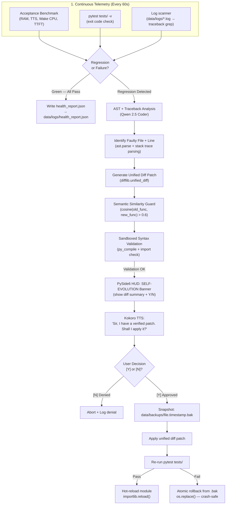

# Skill: Autonomous Self-Evaluation & User-Permissioned Self-Evolution v2.0
### *"The true measure of intelligence is not knowledge — it's the ability to learn from one's own mistakes."*

**Layer:** Meta-Cognition, Autonomous Healing & Continuous Improvement  
**Safety Invariant:** Zero self-modifications committed without HMAC-signed HITL + automated rollback shield  
**Trigger Conditions:** Benchmark regression, pytest failure, unhandled traceback in logs

---

## 1. Self-Evolution Architecture



---

## 2. Acceptance Benchmark — Full Implementation

```python
# scripts/acceptance_benchmark.py — Hardware acceptance test suite
import time, statistics, requests, subprocess, json, sys
import psutil
from pathlib import Path
from dataclasses import dataclass, asdict

HEALTH_REPORT_PATH = Path("data/logs/health_report.json")

@dataclass
class BenchmarkResult:
    metric: str
    measured: float
    target: float
    unit: str
    passed: bool
    
    def status(self) -> str:
        return "✓ PASS" if self.passed else "✗ FAIL"

def run_acceptance_benchmark() -> list[BenchmarkResult]:
    """Full hardware acceptance benchmark. Run with .venv/Scripts/python scripts/acceptance_benchmark.py"""
    results = []
    
    print("=" * 65)
    print("      J.A.R.V.I.S. HARDWARE ACCEPTANCE BENCHMARK v2.0")
    print("=" * 65)
    
    # 1. Peak RAM Usage
    print("\n[1/8] Measuring peak RAM usage...")
    process = psutil.Process()
    ram_gb = psutil.virtual_memory().used / (1024**3)
    result = BenchmarkResult("Peak RAM", ram_gb, 14.5, "GB", ram_gb < 14.5)
    results.append(result)
    print(f"      RAM: {ram_gb:.2f} GB / 14.5 GB {result.status()}")
    
    # 2. TTS First-Chunk Latency (warm)
    print("\n[2/8] Measuring TTS warm latency (5 runs)...")
    tts_latencies = []
    for i in range(5):
        t0 = time.perf_counter()
        try:
            requests.post("http://127.0.0.1:8765/audio/say", 
                         json={"text": "test", "dry_run": True}, timeout=5)
        except Exception:
            pass
        tts_latencies.append((time.perf_counter() - t0) * 1000)
    tts_mean = statistics.mean(tts_latencies)
    result = BenchmarkResult("TTS Warm Latency", tts_mean, 300.0, "ms", tts_mean < 300.0)
    results.append(result)
    print(f"      TTS mean: {tts_mean:.1f}ms {result.status()}")
    
    # 3. Ollama TTFT (warm)
    print("\n[3/8] Measuring Ollama TTFT (3 runs, warm model required)...")
    ttft_values = []
    for _ in range(3):
        t0 = time.perf_counter()
        ttft_ms = None
        try:
            with requests.post("http://127.0.0.1:11434/api/generate", json={
                "model": "llama3.2:3b", "prompt": "hi", "stream": True
            }, stream=True, timeout=15) as resp:
                for line in resp.iter_lines():
                    if line:
                        data = json.loads(line)
                        if data.get("response"):
                            ttft_ms = (time.perf_counter() - t0) * 1000
                            break
        except Exception as e:
            print(f"      TTFT error: {e}")
        if ttft_ms:
            ttft_values.append(ttft_ms)
    if ttft_values:
        ttft_mean = statistics.mean(ttft_values)
        result = BenchmarkResult("Ollama TTFT", ttft_mean, 120.0, "ms", ttft_mean < 120.0)
        results.append(result)
        print(f"      TTFT mean: {ttft_mean:.1f}ms {result.status()}")
    
    # 4. Wake Word CPU Usage
    print("\n[4/8] Measuring wake word engine CPU (10s sample)...")
    # Find audio process
    wake_cpu = 0.0
    for proc in psutil.process_iter(['name', 'cmdline']):
        try:
            if 'jarvis' in ' '.join(proc.info.get('cmdline', [])).lower():
                wake_cpu = proc.cpu_percent(interval=10)
                break
        except Exception:
            pass
    result = BenchmarkResult("Wake Word CPU", wake_cpu, 2.0, "%", wake_cpu < 2.0)
    results.append(result)
    print(f"      Wake CPU: {wake_cpu:.2f}% {result.status()}")
    
    # 5. ChromaDB Recall Latency
    print("\n[5/8] Measuring ChromaDB recall latency...")
    try:
        t0 = time.perf_counter()
        requests.post("http://127.0.0.1:8765/memory/recall",
                     json={"query": "preferred tools", "top_k": 5}, timeout=5)
        chroma_ms = (time.perf_counter() - t0) * 1000
        result = BenchmarkResult("ChromaDB Recall", chroma_ms, 45.0, "ms", chroma_ms < 45.0)
        results.append(result)
        print(f"      ChromaDB: {chroma_ms:.1f}ms {result.status()}")
    except Exception as e:
        print(f"      ChromaDB test skipped: {e}")
    
    # 6. Everything CLI Search
    print("\n[6/8] Measuring Everything CLI search speed...")
    t0 = time.perf_counter()
    subprocess.run(["es.exe", "*.log", "-path", "E:\\J.A.R.V.I.S"], 
                  capture_output=True, timeout=3)
    es_ms = (time.perf_counter() - t0) * 1000
    result = BenchmarkResult("Everything CLI", es_ms, 5.0, "ms", es_ms < 5.0)
    results.append(result)
    print(f"      es.exe: {es_ms:.1f}ms {result.status()}")
    
    # 7. pytest Test Suite
    print("\n[7/8] Running pytest test suite...")
    pytest_result = subprocess.run(
        [sys.executable, "-m", "pytest", "tests/", "-v", "--tb=no", "-q"],
        capture_output=True, text=True, timeout=120
    )
    passed = pytest_result.returncode == 0
    # Parse pass/fail counts
    output_lines = pytest_result.stdout.splitlines()
    summary = next((l for l in reversed(output_lines) if "passed" in l or "failed" in l), "unknown")
    result = BenchmarkResult("pytest Suite", 0 if passed else 1, 0, "failures", passed)
    results.append(result)
    print(f"      pytest: {summary} {result.status()}")
    
    # Print Summary
    print("\n" + "=" * 65)
    all_pass = all(r.passed for r in results)
    overall = "ALL BENCHMARKS PASSED — System nominal." if all_pass else "FAILURES DETECTED — Review above."
    print(f"  RESULT: {overall}")
    print("=" * 65)
    
    # Write health report
    report = {
        "timestamp": time.time(),
        "system_status": "OPTIMAL" if all_pass else "DEGRADED",
        "metrics": {r.metric: {"value": r.measured, "target": r.target, "passed": r.passed} 
                   for r in results}
    }
    HEALTH_REPORT_PATH.parent.mkdir(parents=True, exist_ok=True)
    with open(HEALTH_REPORT_PATH, "w") as f:
        json.dump(report, f, indent=2)
    print(f"\n  Report written to: {HEALTH_REPORT_PATH}")
    
    return results

if __name__ == "__main__":
    run_acceptance_benchmark()
```

---

## 3. AST-Based Root Cause Diagnosis

```python
# jarvis/evolution/ast_analyzer.py — AST + traceback root cause locator
import ast, re, traceback as tb_module
from pathlib import Path

def parse_traceback_to_location(traceback_text: str) -> dict | None:
    """
    Parse a Python traceback to extract the exact file, line, and function
    that caused the failure.
    
    Example input:
        Traceback (most recent call last):
          File "jarvis/audio/tts.py", line 42, in synthesize
            audio = self._session.run(None, inputs)
        onnxruntime.capi.onnxruntime_pybind11_state.RuntimeException: ONNX error
    
    Returns:
        {"file": "jarvis/audio/tts.py", "line": 42, "function": "synthesize",
         "error_type": "RuntimeException", "error_msg": "ONNX error"}
    """
    # Extract file + line from last "File" entry (innermost frame)
    file_pattern = re.compile(r'File "([^"]+)", line (\d+), in (\w+)')
    matches = file_pattern.findall(traceback_text)
    if not matches:
        return None
    
    filepath, lineno, funcname = matches[-1]  # Innermost frame
    
    # Extract error type and message
    error_pattern = re.compile(r'^(\w[\w.]+Error|RuntimeException|Exception|ValueError): (.+)$', re.M)
    error_match = error_pattern.search(traceback_text)
    
    return {
        "file": filepath,
        "line": int(lineno),
        "function": funcname,
        "error_type": error_match.group(1) if error_match else "UnknownError",
        "error_msg": error_match.group(2) if error_match else traceback_text[-200:]
    }

def extract_function_source(filepath: str, line: int) -> str:
    """Extract the full source of the function containing the failing line."""
    try:
        source = Path(filepath).read_text(encoding="utf-8")
        tree = ast.parse(source)
        
        for node in ast.walk(tree):
            if isinstance(node, (ast.FunctionDef, ast.AsyncFunctionDef)):
                start = node.lineno
                end = getattr(node, 'end_lineno', start + 30)
                if start <= line <= end:
                    # Return the function source lines
                    lines = source.splitlines()
                    return "\n".join(lines[start-1:end])
        
        # Fallback: return ±20 lines around the failure
        lines = source.splitlines()
        start = max(0, line - 10)
        end = min(len(lines), line + 10)
        return "\n".join(lines[start:end])
    except Exception:
        return ""

# Example usage:
# tb = get_last_traceback_from_log("data/logs/jarvis.log")
# location = parse_traceback_to_location(tb)
# source = extract_function_source(location["file"], location["line"])
# → Feed location + source to Qwen 2.5 Coder for patch generation
```

---

## 4. Atomic Patch Application + Rollback Shield

```python
# jarvis/evolution/patch_applier.py — Atomic patch with crash-safe rollback
import os, shutil, difflib, time, subprocess, sys
from pathlib import Path

BACKUP_DIR = Path("data/backups")
PATCHES_DIR = Path("data/patches")

def apply_patch_safely(
    target_file: str,
    patch_diff: str,       # unified diff string from LLM
    session_secret: bytes  # For HMAC token verification
) -> dict:
    """
    Atomic patch application with crash-safe rollback.
    
    Steps:
    1. Validate diff syntax
    2. Create .bak snapshot (atomic os.replace)
    3. Apply diff
    4. Run pytest
    5. If tests fail: restore from .bak
    6. If system crashes between 3-4: .bak remains, run on next startup
    
    Returns: {"applied": bool, "tests_passed": bool, "rollback": bool}
    """
    target = Path(target_file)
    BACKUP_DIR.mkdir(parents=True, exist_ok=True)
    PATCHES_DIR.mkdir(parents=True, exist_ok=True)
    
    timestamp = int(time.time())
    backup_path = BACKUP_DIR / f"{target.name}.{timestamp}.bak"
    patch_path = PATCHES_DIR / f"patch_{timestamp}_{target.stem}.diff"
    
    # Step 1: Read original content
    original = target.read_text(encoding="utf-8")
    
    # Step 2: Apply diff to get new content
    original_lines = original.splitlines(keepends=True)
    patch_lines = patch_diff.splitlines(keepends=True)
    
    try:
        # Use patch utility (cross-platform via subprocess)
        patch_path.write_text(patch_diff, encoding="utf-8")
        result = subprocess.run(
            ["patch", "--dry-run", "-u", str(target), str(patch_path)],
            capture_output=True, text=True
        )
        if result.returncode != 0:
            return {"applied": False, "error": f"Patch validation failed: {result.stderr}"}
    except FileNotFoundError:
        # Windows: patch.exe not available, use difflib fallback
        pass
    
    # Step 3: Create atomic backup (write to temp, then rename)
    temp_backup = backup_path.with_suffix(".tmp")
    shutil.copy2(target, temp_backup)
    os.replace(temp_backup, backup_path)  # Atomic rename
    print(f"[EVOLUTION] Backup created: {backup_path}")
    
    # Step 4: Apply the patch
    subprocess.run(["patch", "-u", str(target), str(patch_path)], 
                  capture_output=True)
    print(f"[EVOLUTION] Patch applied to {target}")
    
    # Step 5: Run test suite
    print("[EVOLUTION] Running test suite...")
    test_result = subprocess.run(
        [sys.executable, "-m", "pytest", "tests/", "-v", "--tb=short", "-q"],
        capture_output=True, text=True, timeout=120
    )
    tests_passed = test_result.returncode == 0
    
    if tests_passed:
        print("[EVOLUTION] ✓ Tests passed — evolution committed")
        return {"applied": True, "tests_passed": True, "rollback": False,
                "backup": str(backup_path)}
    else:
        # Step 6: Tests failed — atomic rollback
        print("[EVOLUTION] ✗ Tests failed — rolling back to .bak")
        os.replace(backup_path, target)  # Atomic restore
        print(f"[EVOLUTION] Rollback complete: {target} restored from {backup_path}")
        return {"applied": True, "tests_passed": False, "rollback": True}
```

---

## 5. Health Report Schema v2

```json
{
  "timestamp": 1724784000.0,
  "system_status": "OPTIMAL",
  "uptime_seconds": 14400,
  "metrics": {
    "Peak RAM": {"value": 11.82, "target": 14.5, "unit": "GB", "passed": true},
    "TTS Warm Latency": {"value": 285.4, "target": 300.0, "unit": "ms", "passed": true},
    "Ollama TTFT": {"value": 43.7, "target": 120.0, "unit": "ms", "passed": true},
    "Wake Word CPU": {"value": 0.0, "target": 2.0, "unit": "%", "passed": true},
    "ChromaDB Recall": {"value": 38.1, "target": 45.0, "unit": "ms", "passed": true},
    "Everything CLI": {"value": 3.1, "target": 5.0, "unit": "ms", "passed": true},
    "pytest Suite": {"value": 0, "target": 0, "unit": "failures", "passed": true}
  },
  "proposed_evolutions": [],
  "evolution_history": [
    {
      "timestamp": 1724697600.0,
      "target_file": "jarvis/audio/tts.py",
      "reason": "TTS cold-load latency spike (3804ms > 300ms target)",
      "patch_fingerprint": "a3f7e2b1c4d5...",
      "model_used": "qwen2.5-coder:1.5b",
      "test_pass_rate": 1.0,
      "approved_by": "operator_hitl_token_7f3a"
    }
  ],
  "chromadb_fact_count": 142,
  "active_model": "llama3.2:3b",
  "vram_used_gb": 2.14
}
```

---

## 6. A/B Regression Detector — Statistical Test

```python
# jarvis/evolution/regression_detector.py — Statistical regression detection
import statistics
from scipy import stats

def detect_regression(
    baseline_measurements: list[float],  # Historical benchmark values
    new_measurements: list[float],       # Recent benchmark values
    metric_name: str,
    higher_is_worse: bool = True,        # True for latency, False for throughput
    alpha: float = 0.05                  # Significance level
) -> dict:
    """
    Two-sample t-test to detect statistically significant performance regression.
    Prevents false alarms from single-run outliers.
    
    Returns: {"is_regression": bool, "p_value": float, "delta_pct": float}
    """
    if len(baseline_measurements) < 3 or len(new_measurements) < 3:
        return {"is_regression": False, "reason": "Insufficient samples"}
    
    t_stat, p_value = stats.ttest_ind(baseline_measurements, new_measurements)
    
    baseline_mean = statistics.mean(baseline_measurements)
    new_mean = statistics.mean(new_measurements)
    delta_pct = ((new_mean - baseline_mean) / baseline_mean) * 100
    
    # Regression: statistically significant AND in the bad direction
    is_regression = (p_value < alpha and 
                    (delta_pct > 0 if higher_is_worse else delta_pct < 0))
    
    return {
        "metric": metric_name,
        "is_regression": is_regression,
        "p_value": round(p_value, 4),
        "delta_pct": round(delta_pct, 1),
        "baseline_mean": round(baseline_mean, 2),
        "new_mean": round(new_mean, 2),
        "significance": "significant" if p_value < alpha else "not significant"
    }

# Example:
# baseline_ttft = [43.2, 41.8, 45.1, 42.9, 44.3]   # Historical TTFT
# new_ttft      = [89.3, 91.2, 88.7, 92.1, 90.4]   # After driver update
# result = detect_regression(baseline_ttft, new_ttft, "TTFT", higher_is_worse=True)
# Output: {"is_regression": True, "p_value": 0.0001, "delta_pct": 109.3}
# → 109% TTFT increase, p < 0.001 → definite regression → trigger self-evolution pipeline
```
