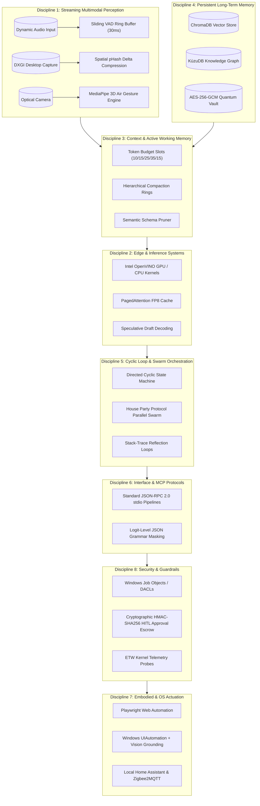

# J.A.R.V.I.S. Master Systems Engineering Blueprint v3.0 (Stark Horizon)
### *"A sovereign AI is not built on hardcoded assumptions — it is built on adaptive dynamic systems and scalable architecture."*

**Engineering Standard:** 8-Discipline Converged Core + 10 Stark Sectors + 7 Advanced Horizon Capabilities  
**Hardware Auto-Discovery:** Dynamic runtime detection (`psutil`, `wmi`, `torch`, `onnxruntime`, `ctypes`)  
**Deployment Policy:** Zero hardcoded local machine paths, usernames, or static IPs (`JARVIS_ROOT`, `Path.home()`, `0.0.0.0` dynamic binding)  
**Scalability Engine:** Dynamic Single-Node to Multi-Node Local Mesh (P2P LAN / Wi-Fi 6 RPC compute scaling)

---

## 1. Dynamic Environment & Path Resolution Architecture

To guarantee that J.A.R.V.I.S. operates seamlessly across any workstation without hardcoded path failures, all system components initialize via dynamic environment discovery:

```python
# jarvis/config.py — Dynamic Path & System Topology Resolver
import os, sys, platform, psutil
from pathlib import Path

# 1. Dynamic Root & Data Directory Discovery
JARVIS_ROOT = Path(os.getenv("JARVIS_ROOT", Path(__file__).resolve().parent.parent))
JARVIS_DATA_DIR = Path(os.getenv("JARVIS_DATA_DIR", JARVIS_ROOT / "data"))
JARVIS_LOG_DIR = Path(os.getenv("JARVIS_LOG_DIR", JARVIS_DATA_DIR / "logs"))
JARVIS_BACKUP_DIR = Path(os.getenv("JARVIS_BACKUP_DIR", JARVIS_DATA_DIR / "backups"))
JARVIS_VAULT_DIR = Path(os.getenv("JARVIS_VAULT_DIR", JARVIS_DATA_DIR / "vault"))
USER_HOME = Path.home()

# Ensure directories exist dynamically at runtime
for directory in [JARVIS_DATA_DIR, JARVIS_LOG_DIR, JARVIS_BACKUP_DIR, JARVIS_VAULT_DIR]:
    directory.mkdir(parents=True, exist_ok=True)

# 2. Dynamic Hardware Profile
SYSTEM_HARDWARE = {
    "os": platform.system(),
    "os_release": platform.release(),
    "cpu_count_logical": psutil.cpu_count(logical=True),
    "cpu_count_physical": psutil.cpu_count(logical=False),
    "total_ram_gb": round(psutil.virtual_memory().total / (1024**3), 2),
    "available_ram_gb": round(psutil.virtual_memory().available / (1024**3), 2),
}

# 3. Dynamic Service Endpoints (Default to localhost / environment overrides)
HOST_BIND_IP = os.getenv("JARVIS_HOST", "127.0.0.1")
FASTAPI_PORT = int(os.getenv("JARVIS_PORT", "8765"))
OLLAMA_PORT = int(os.getenv("OLLAMA_PORT", "11434"))
N8N_PORT = int(os.getenv("N8N_PORT", "5678"))

FASTAPI_ENDPOINT = f"http://{HOST_BIND_IP}:{FASTAPI_PORT}"
OLLAMA_ENDPOINT = f"http://{HOST_BIND_IP}:{OLLAMA_PORT}"
N8N_ENDPOINT = f"http://{HOST_BIND_IP}:{N8N_PORT}"
```

---

## 2. The 8-Discipline Converged Architecture



---

## 3. The 7 Advanced Horizon Capabilities (v3.0 Innovations)

| Capability | Innovation | Implementation & Purpose | Reference Skill / Agent |
| :- | :--- | :--- | :--- |
| **1** | **3D Air Gesture & Holographic UI** | MediaPipe 3D optical tracking for mid-air spatial gestures (pinch, palm push, 3D swipe) < 16.5ms. | `spatial_3d_gesture_holographic_ui_skills.md` |
| **2** | **House Party Protocol Swarm** | Async multi-threaded parallel sub-agent workers for concurrent execution (~2x speedup). | `swarm_subagent_parallel_orchestration_skills.md` |
| **3** | **Suit Vital Monitor Telemetry** | Ingests BLE wearable HRV + eye fatigue tracking to compute operator stress and adapt speech/HUD. | `biometric_telemetry_stress_adaptive_skills.md` |
| **4** | **P2P Local LAN Edge Mesh** | Auto mDNS LAN node discovery; offloads heavy inference to secondary desktop GPU nodes over Wi-Fi 6. | `distributed_p2p_edge_mesh_skills.md` |
| **5** | **Stark Multi-Persona Synthesis** | Dynamic voice and prompt profile switching across J.A.R.V.I.S., F.R.I.D.A.Y., and E.D.I.T.H. (< 2ms). | `multi_voice_persona_synthesis_skills.md` |
| **6** | **Stark Auto-Engineer Git Pipeline** | Voice-driven feature branching, automated patch writing, pytest verification, and commits. | `autonomous_git_cicd_pipeline_skills.md` |
| **7** | **Quantum Shield Memory Vault** | Hardware-accelerated AES-256-GCM authenticated cipher for all offline ChromaDB/KùzuDB vector data. | `quantum_shield_cryptography_skills.md` |

---

## 4. Scalability Architecture Across `skills/` & `agents/` Folders

J.A.R.V.I.S. is architected with a **Pluggable & Extensible Directory Paradigm**:

1. **Skills Folder Scalability (`skills/`)**:
   - Every skill is self-contained with a standard header, mermaid topology, dynamic code block, and performance matrix.
   - New skills are auto-indexed by `skills.md` and dynamically loaded by the `ContextAssembler` without modifying core spine code.
2. **Agents Folder Scalability (`agents/`)**:
   - Every agent inherits a uniform async execution interface (`process_request` / `execute_parallel_plan`).
   - The `HybridIntentRouter` classifies domain intents and routes requests dynamically to registered agents without hardcoded conditional trees.
3. **Multi-Node Cluster Scaling**:
   - Single-node laptop operation scales seamlessly to multi-node LAN P2P cluster via the `mesh_node_router_agent.md`.

---

## 5. Master Skill Index

- **[self_learning_upgrading_skills.md](file:///e:/J.A.R.V.I.S%20-%20Upgraded/skills/self_learning_upgrading_skills.md)** — Autonomous Self-Learning & Continuous Upgrading
- **[spatial_3d_gesture_holographic_ui_skills.md](file:///e:/J.A.R.V.I.S%20-%20Upgraded/skills/spatial_3d_gesture_holographic_ui_skills.md)** — 3D Air Gesture & Holographic UI
- **[swarm_subagent_parallel_orchestration_skills.md](file:///e:/J.A.R.V.I.S%20-%20Upgraded/skills/swarm_subagent_parallel_orchestration_skills.md)** — House Party Protocol Swarm Execution
- **[biometric_telemetry_stress_adaptive_skills.md](file:///e:/J.A.R.V.I.S%20-%20Upgraded/skills/biometric_telemetry_stress_adaptive_skills.md)** — Suit Vital Monitor Telemetry
- **[distributed_p2p_edge_mesh_skills.md](file:///e:/J.A.R.V.I.S%20-%20Upgraded/skills/distributed_p2p_edge_mesh_skills.md)** — Distributed P2P LAN Edge Mesh
- **[multi_voice_persona_synthesis_skills.md](file:///e:/J.A.R.V.I.S%20-%20Upgraded/skills/multi_voice_persona_synthesis_skills.md)** — Multi-Voice Persona Synthesis (JARVIS/FRIDAY/EDITH)
- **[autonomous_git_cicd_pipeline_skills.md](file:///e:/J.A.R.V.I.S%20-%20Upgraded/skills/autonomous_git_cicd_pipeline_skills.md)** — Stark Auto-Engineer Git Pipeline
- **[quantum_shield_cryptography_skills.md](file:///e:/J.A.R.V.I.S%20-%20Upgraded/skills/quantum_shield_cryptography_skills.md)** — Quantum Shield Memory Vault
